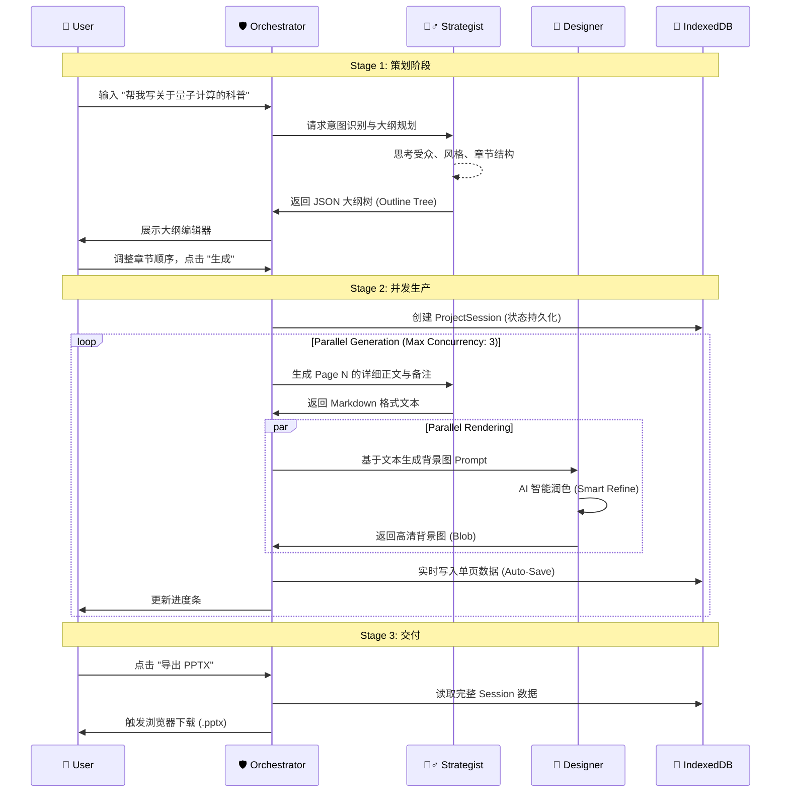

# 🤖 Multi-Agent System Architecture (多代理协同架构)

> **BananaSlides-GenAI** 并非简单的 LLM 接口调用，而是一个拥有明确分工、严谨数据流与错误自愈能力的 **多代理协同系统 (Multi-Agent System)**。

---

## 🏛️ 代理角色矩阵 (Agent Matrix)

系统核心由三个具备独立职能的“虚拟专家”组成，它们共享上下文，但拥有独立的 Prompt System 和 Error Handling 策略。

### 1. 🧙‍♂️ Content Strategist (内容策略师)

_负责理性的逻辑与结构_

| 维度            | 属性描述                                                           |
| :-------------- | :----------------------------------------------------------------- |
| **底层模型**    | `gemini-3-pro-preview` / `gpt-4-turbo` / `glm-4-plus`              |
| **核心职能**    | 意图识别、大纲规划、数据提取、演讲备注撰写。                       |
| **输出格式**    | 严格的 **JSON Schema**，确保大纲层级树 (Outline Tree) 绝对可解析。 |
| **Prompt 特性** | 强调逻辑性、结构化思维与商业分析框架 (SWOT, PEST)。                |
| **代码映射**    | `components/OutlineGenerator.tsx` -> `generateOutline()`           |

### 2. 🎨 Visual Designer (视觉设计师)

_负责感性的审美与渲染_

| 维度            | 属性描述                                                         |
| :-------------- | :--------------------------------------------------------------- |
| **底层模型**    | `gemini-3-pro-image` / `dall-e-3` / `flux-pro`                   |
| **核心职能**    | 风格迁移、Prompt 编译、色彩心理学分析、背景图渲染。              |
| **输出格式**    | 16:9 高清图像 (Base64/Blob) + 布局坐标建议。                     |
| **Prompt 特性** | 内置丰富的艺术词库 (Artstation, Cyberpunk, Cinematic Lighting)。 |
| **代码映射**    | `services/geminiService.ts` -> `generateImage()`                 |

### 3. 🛡️ System Orchestrator (系统调度中枢)

_负责系统的稳定与交付_

| 维度         | 属性描述                                                              |
| :----------- | :-------------------------------------------------------------------- |
| **底层模型** | _N/A (React 运行时逻辑)_                                              |
| **核心职能** | 任务分发、状态管理 (IndexedDB)、错误熔断、并发控制。                  |
| **容错机制** | 当下游代理超时或报错时，自动触发重试 (Retry) 或降级 (Fallback) 策略。 |
| **最终交付** | 将各代理产出的碎片化素材，组装为标准的 `.pptx` 二进制文件。           |
| **代码映射** | `App.tsx` (ProjectSession 管理) + `services/exportService.ts`         |

---

## 🔄 协作流水线 (The Pipeline)

一个标准的 PPT 生成任务，实际上是一场精密的接力赛。

---

## 🧠 核心技术亮点

### 1. 结构化思维链 (Structured CoT)

Content Strategist 不仅仅是写字，它遵循 **ReAct (Reason + Act)** 模式：

1.  **Thought**: 用户说"年会"，意味着需要热闹、庆祝的氛围，受众是全公司员工。
2.  **Plan**: 封面要宏大，中间要有数据回顾，结尾要有展望。
3.  **Action**: 生成对应的 JSON 节点。

### 2. 视觉语义映射 (Visual-Semantic Mapping)

Visual Designer 拥有一套 **"文本转视觉"** 的翻译引擎：

- 输入: "公司的业绩增长很快"
- 转换: "Rising bar chart, futuristic hud interface, upward arrow, golden lighting"
- 结果: 一张寓意增长的科技感背景图，而不是简单的文字堆砌。

### 3. 本地状态优先 (Local-First State)

Orchestrator 采用 **"乐观更新 (Optimistic UI)"** + **"最终一致性"** 策略：

- 用户的每一步操作都立即反馈在 UI 上。
- 后台静默将数据写入 `IndexedDB`。
- 即使浏览器崩溃，重启后 `App.tsx` 会根据 `lastActiveProject` 自动恢复现场。
