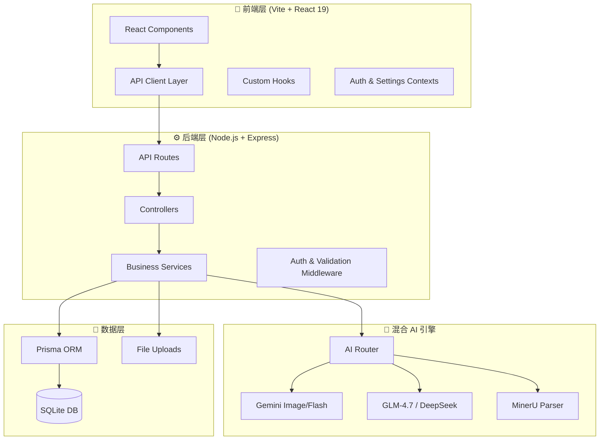

# 🍌 BananaSlides-GenAI

**新一代混合 AI 引擎驱动的智能演示文稿全链条设计平台**

> 融合 Google Gemini 的"视觉原生"能力与 GLM/DeepSeek 生态的通用逻辑推理，集成 **MinerU 工业级智能文档解析内核**，旨在通过"意图驱动"的设计哲学，将复杂的 PPT 创作过程降维至分钟级响应。

---

## 🎯 项目愿景

BananaSlides 致力于通过"感知与生成"的双重迭代，实现以下核心价值：

- **内容重塑与语义唤醒**: 彻底打通从"非结构化文档 -> 结构化大纲 -> 详细章节正文"的自动演进链路，支持 AI 主题修饰与**原生的 MinerU 文档语义解构**。
- **视觉基因的精准复制**: 独创的 4 层级 Prompt 智能合成算法，配合视觉预处理（Vision Pre-processing），确保每一页变体图片都能完美吻合参考图的质感、配色与构图。
- **混合 AI 引擎的全球化调度**: 灵活切换 GLM-4.7 (逻辑推理)、Gemini Image (极致审美) 与本地 Llama/Qwen (离线安全)，实现成本、速度与质量的最优指数级平衡。
- **工业级生产力韧性**: 基于快照的版本时光机与项目自动归档系统，让每一次灵感闪现都有迹可循，支持资产的二次循环利用。

---

## 🏗️ 系统架构全景图

### Mermaid 模块结构图



### 模块索引表

| 模块路径 | 描述 | 关键文件 |
|---------|------|---------|
| [`/src`](./src/CLAUDE.md) | 前端 React 应用 | `App.tsx`, `main.tsx` |
| [`/src/components`](./src/components/CLAUDE.md) | UI 组件库 | `Dashboard.tsx`, `admin/` |
| [`/src/api`](./src/api/CLAUDE.md) | API 客户端 | `client.ts`, `projectApi.ts` |
| [`/server`](./server/CLAUDE.md) | Node.js 后端 | `src/app.ts` |
| [`/server/src/services`](./server/src/services/CLAUDE.md) | 业务服务层 | `ai.service.ts`, `project.service.ts` |
| [`/server/src/controllers`](./server/src/controllers/CLAUDE.md) | 控制器层 | `project.controller.ts` |
| [`/server/prisma`](./server/prisma/CLAUDE.md) | 数据库模型 | `schema.prisma` |
| [`/docs`](./docs/) | 技术文档 | 30+ 设计规范文档 |

---

## 🛠️ 运行与开发指南

### 环境要求

- **Node.js**: v18.x 或以上版本（推荐 v22+）
- **API Key**: [Gemini API Key](https://aistudio.google.com/) (必填) 或 火山引擎 API Key

### 快速启动

```bash
# 1. 安装依赖
npm install && cd server && npm install

# 2. 初始化数据库
npx prisma db push

# 3. 启动开发服务器
npm run dev           # 前端 (port 1000)
npm run dev:server    # 后端 (port 1111)

# Windows 一键启动
start_app.bat
```

### 后端配置 (`server/.env`)

```env
# 核心通信端口
PORT=1111
# 数据库存储
DATABASE_URL="file:./dev.db"
# AI 混合引擎配置
AI_PROVIDER="Volcengine"
COMBO_TEXT_MODEL="gemini-3-flash"
COMBO_IMAGE_MODEL="gemini-3-pro-image"
COMBO_VISION_MODEL="gemini-3-flash"
DOC_PARSER_BASE="https://mineru.net"
DOC_PARSER_PROVIDER="MinerU"
```

---

## 🧪 测试策略

| 测试类型 | 工具 | 覆盖范围 | 执行命令 |
|---------|------|---------|---------|
| E2E 测试 | Playwright | 完整用户流程 | `npm run test` |
| 单元测试 | Vitest | 核心工具函数 | `npm run test:unit` |
| API 测试 | Pytest | 后端 API 接口 | `pytest tests/` |

---

## 📝 编码规范

### TypeScript
- **Experimental decorators** enabled (legacy Angular-style)
- **Path alias:** `@/` maps to `./src/`
- **No emit:** TypeScript only for type checking
- **Shared types:** Duplicated between `src/types.ts` and `server/src/types.ts`

### React
- **Functional components** with hooks
- **TanStack Query** for server state management
- **Framer Motion** for animations
- **react-hot-toast** for notifications

### Backend
- **Service layer pattern:** Controllers → Services → Prisma
- **Route registration:** Order matters (auth routes before protected routes)
- **Hot reload:** `.env` changes trigger `SettingService.reloadEnv()`

---

## 🚫 反模式清单 (ANTI-PATTERNS)

1. **禁止绕过服务层** - 始终通过 `*Service` 类路由，禁止从控制器直接调用 Prisma
2. **禁止重复类型** - 共享类型存在于前后端；手动保持同步
3. **禁止使用 any** - 项目使用严格 TypeScript；避免 `as any` 或 `@ts-ignore`
4. **禁止硬编码 AI 提供商** - 使用 `SettingService` 进行动态模型切换
5. **禁止直接修改生产环境 .env** - 使用管理员设置 API 进行运行时配置更改

---

## 🎯 独特技术亮点 (UNIQUE STYLES)

1. **Hybrid AI Router** - 按任务类型路由：Gemini 生图、GLM/DeepSeek 逻辑、MinerU 文档解析
2. **4-Level Prompt Synthesis** - L1 视觉基因 → L2 业务语义 → L3 指令融合 → L4 技术参数
3. **Snapshot versioning** - 通过 `snapshot.service.ts` 实现项目时光机回滚
4. **Points-based billing** - 积分制 AI 生成计费，非订阅模式
5. **Capsule navigation** - 滚动时 Header 收缩为悬浮胶囊的 UI 模式

---

## 🔮 未来演进路线 (Roadmap)

- [ ] **可视化排版 Agent**: 智能感知文字重心，自动决定图文对齐策略
- [ ] **高阶运动引擎**: 输出支持 PowerPoint 动画切页路径的物理文件
- [ ] **共享创意云**: 团队实时协作光标，共同打磨每一页细节

---

*BananaSlides: 让每一场演示都能直抵人心。*
