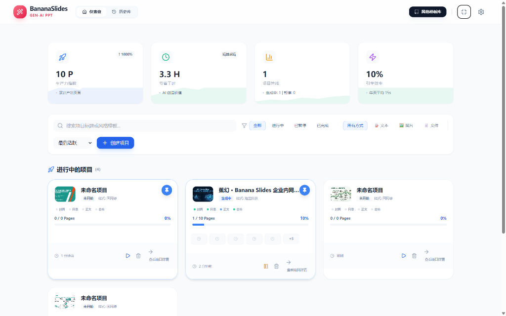
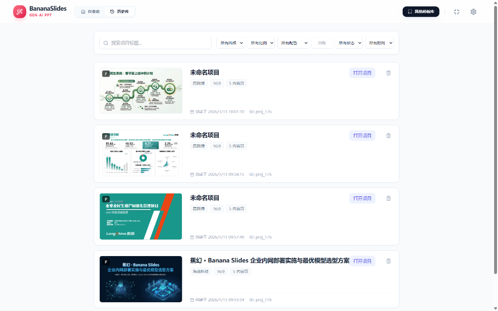
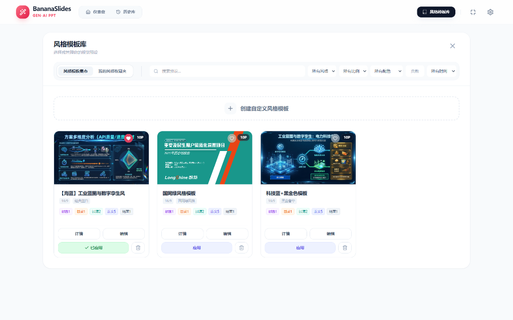
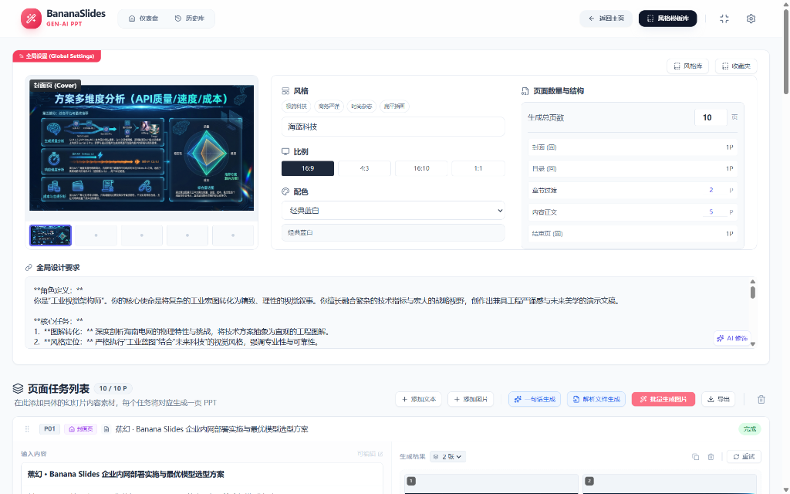
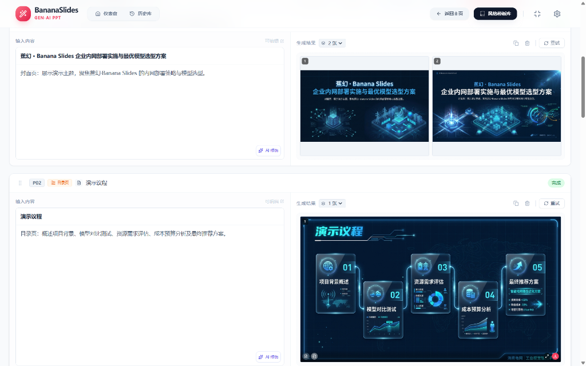

# 🍌 BananaSlides-GenAI | 产品白皮书

> **让灵感落地为演示文稿，仅需一键。**
> BananaSlides-GenAI 是由 **多模型混合引擎 (Hybrid AI Engine)** 与 **多代理系统 (Multi-Agent System)** 驱动的企业级 PPT 自动化生产平台。支持 **Google Gemini / OpenAI / Anthropic / 智谱 AI** 等任意大模型后端。

---

### 📸 产品预览 (Product Showcase)

<div align="center">
  <!-- 核心仪表盘 -->
  
  
  <!-- 功能矩阵图组 -->
  <div style="display: flex; gap: 14px; justify-content: space-between; margin-bottom: 14px;">
    
    
  </div>
  
  <div style="display: flex; gap: 14px; justify-content: space-between;">
    
    
  </div>
  <p style="color: #666; font-size: 12px; margin-top: 10px;">(左上: 多任务管理 | 右上: 风格模板库 | 左下: AI 润色配置 | 右下: 最终渲染效果)</p>
</div>

---

## 1. 核心产品能力 (Core Capabilities)

### 🧠 智能策划中心 (The Brain)

告别空白文档的恐惧。我们的 **Content Strategist** 代理能够处理多种复杂的输入形式：

- **一句话生成 (One-Shot Mode)**: 输入 "帮我写一个关于新能源汽车出海的商业计划书"，系统自动拆解为 12 页标准 BP 结构。
- **长文档理解 (RAG Mode)** [Coming Soon]: 计划支持上传 PDF/Word/TXT 行业报告，AI 自动提取关键数据与论点 (开发中)。
- **自动页面规划**: 智能识别文档类型，自动匹配 **"封面-目录-过渡-正文-结尾"** 的黄金叙事结构。
- **深度内容扩充**: 每一页不仅仅有标题，AI 还会自动撰写 200 字以上的演讲备注与正文详情，确保内容言之有物。

### 🎨 视觉工场 (The Studio)

每一页 PPT 都是一张海报。我们的 **Visual Designer** 代理具备极高的审美：

- **多风格预设**: 内置 "科技蓝、极简白、黑金商务、赛博朋克" 等 10+ 种专业配色方案。
- **AI 智能润色 (Smart Refine)** [FEATURE]: 不会写提示词？在样式编辑器中输入 "五彩斑斓的黑"，AI 自动将其翻译为 _"Holographic dark theme, iridescent gradients, neo-noir atmosphere..."_。
- **参考图复刻 (Style Transfer)**: 上传一张你喜欢的 PPT 截图，AI 自动分析其 **配色占比** 与 **构图模式**，并应用到你的新项目中。
- **4K 极清渲染**: 支持生成 4096x2304 分辨率的超清背景，适配大型 LED 屏幕。

### 📊 生产力仪表盘 (Productivity Dashboard)

不仅仅是生成器，更是你的 **PPT 项目管理工作台**：

- **多项目并行 (Multi-Session)**: 同时管理多个 PPT 项目，随时切换上下文。
- **状态持久化 (Auto-Save)**: 所有操作实时存入 IndexedDB。浏览器崩溃？电脑断电？重启后，进度条依然停留在你离开的那一秒。
- **效能统计**: 实时统计 "已生成页数" 与 "节省工时"，让生产力可视化。

### ⚡ 混合 AI 引擎 (Hybrid Engine)

打破单一模型的桎梏，我们支持 **模型路由 (Model Routing)** 技术：

- **文本脑**: 默认使用 **Gemini 3 Pro Preview** (亦可切换至 **GPT-4** 或 **GLM-4.7**) 处理复杂的逻辑推演。
- **图像脑**: 使用 **Gemini 3 Pro Image** 生成精准的图表与背景。
- **组合模式 (Custom Combo)**: 支持将文本、图像、视觉任务分别指派给不同的 API 提供商 (如 **GLM-4.7** + **Gemini 3 Flash**)。

---

## 2. 详细功能清单 (Comprehensive Feature Matrix)

| 模块       | 子模块         | 功能描述                                                                                    | 状态 |
| :--------- | :------------- | :------------------------------------------------------------------------------------------ | :--- |
| **工作台** | **多项目管理** | 支持创建、暂停、删除、置顶项目；项目列表按“最后活跃/创建时间/进度”排序。                    | ✅   |
|            | **数据看板**   | 实时显示 Productivity Points, 节省工时, 成功率, 周环比增长趋势 (Sparkline)。                | ✅   |
|            | **状态过滤**   | 快速筛选“进行中/已暂停/已完成”项目；支持按“文本/图片/文件”生成方式过滤。                    | ✅   |
|            | **历史归档**   | 已完成项目自动归档折叠，保持工作台清爽；支持只读模式查看历史详情。                          | ✅   |
| **输入层** | **指令理解**   | 支持 One-Shot 一句话需求生成 (e.g., "生成一份年终总结 PPT")。                               | ✅   |
|            | **结构化 RAG** | _[Coming Soon]_ 支持上传 PDF/Word 文档进行长文本深度解析。                                  | 🚧   |
| **策划层** | **大纲编辑器** | 支持拖拽排序 (DnD)、增删章节、手动修改大纲文案、重新生成特定章节。                          | ✅   |
|            | **智能扩写**   | AI 自动为每一页生成 200 字+ 的演讲备注与正文详情。                                          | ✅   |
| **视觉层** | **样式编辑器** | 所见即所得 (WYSIWYG) 的样式配置；支持 16:9 / 4:3 / 1:1 多比例切换。                         | ✅   |
|            | **高级筛选**   | 风格库支持按“色系、风格标签、比例、页数、时间”进行多维度筛选。                              | ✅   |
|            | **AI 润色**    | **Smart Refine**: 基于语义理解自动优化风格提示词 (e.g., "科技感" -> "Cyberpunk, Neon...")。 | ✅   |
|            | **自定义模版** | 支持用户创建私有风格模版，并一键收藏到 "Favorites" 面板。                                   | ✅   |
| **生成层** | **混合引擎**   | 路由支持 Google Gemini (Pro/Flash/Image), OpenAI (GPT-4/DALL-E), 智谱 (GLM-4)。             | ✅   |
|            | **高并发渲染** | 支持自定义并发数 (Concurrency: 1-5)，充分利用 API Rate Limit。                              | ✅   |
|            | **容错熔断**   | 单页失败不卡死流程，支持单页 "重试 / 重新生成"；全局 ErrorBoundary 保护。                   | ✅   |
| **结果页** | **交互预览**   | 支持生成结果的点击放大 (Lightbox)、拖拽排序、单页删除/复制。                                | ✅   |
|            | **内容微调**   | 支持对生成结果进行二次 AI 润色 (Refine Content) 或手动覆盖图片。                            | ✅   |
| **输出层** | **原生导出**   | **PPTX**: 导出为可编辑的 PowerPoint 文件 (含母版)；**PDF**: 导出高清文档。                  | ✅   |

---

## 3. 技术架构 (Technical Stack)

本项目采用 **Local-First (本地优先)** 架构，所有数据存储在用户浏览器本地，不仅保护隐私，且极其轻量。

- **前端框架**: [React 19](https://react.dev/) + [Vite 6](https://vitejs.dev/) - 追求极致的构建速度与运行时性能。
- **UI 系统**: [Tailwind CSS](https://tailwindcss.com/) + [Lucide Icons](https://lucide.dev/) - 构建现代化、响应式的 Glassmorphism 界面。
- **AI SDK**: [Google GenAI SDK](https://github.com/google/generative-ai-js) - 官方原生支持，稳定性远超第三方封装。
- **状态管理**: React Context + IndexedDB - 实现复杂的多会话管理与数据持久化。

---

## 4. 快速上手 (Quick Start)

1.  **环境准备**: 确保安装 Node.js (v18+) 和 Git。
2.  **获取代码**:
    ```bash
    git clone https://github.com/your-username/bananaslides-genai.git
    cd bananaslides-genai
    ```
3.  **安装依赖**:
    ```bash
    npm install
    ```
4.  **配置密钥**:
    在根目录创建 `.env.local` 文件：
    ```env
    VITE_GEMINI_API_KEY=AIZaSy... (你的 Google API Key)
    ```
5.  **启动引擎**:
    ```bash
    npm run dev
    ```
    打开浏览器访问 `http://localhost:1000/`，开始你的创作之旅。

---

## 5. 未来规划 (Roadmap)

我们正在持续迭代 BananaSlides-GenAI，致力于将其打造为 AI Presentation 领域的标杆产品。以下是即将到来的核心特性：

### Phase 1: 深度理解 (Deep Understanding)

- [ ] **RAG 引擎集成**: 本地解析 PDF/Word/Markdown 文档，实现基于私有知识库的 PPT 生成。
- [ ] **联网搜索 (Web Search)**: 自动搜索互联网实时数据（如股价、新闻、竞品分析）并生成图表。

### Phase 2: 协作与云 (Cloud & Collab)

- [ ] **云端同步**: 可选的 Cloud Sync 功能，跨设备同步项目与自定义风格模版。
- [ ] **团队空间**: 支持多人协作编辑同一份 PPT 大纲与视觉风格。

### Phase 3: 生态扩展 (Ecosystem)

- [ ] **插件系统**: 开放 API，允许第三方开发者创建自定义的数据源连接器（如 Jira, Notion）。
- [ ] **逆向工程**: 支持导入现有 PPTX 文件，AI 自动拆解并重构其视觉风格。

---

## 6. 文档导航

- **[GEMINI.md](./GEMINI.md)**: **配置手册**。包含 API Key 配置、模型参数调优、速率限制处理以及如何配置“组合模式”。
- **[AGENTS.md](./AGENTS.md)**: **架构文档**。深入了解幕后的 Content Strategist 与 Visual Designer 代理是如何协作的。

---

---

## 7. 关于开发者 & 支持 (About & Support)

**BananaSlides-GenAI** 是由 **@hangy** 与 **@466852675** 用 ❤️ 和 ☕️ 构建的开源项目。

我们致力于探索 GenAI 在生产力工具领域的边界。如果您觉得这个项目对您有帮助，或者为您节省了宝贵的时间，欢迎通过以下方式支持我们：

- 🌟 **Star on GitHub**: 点击右上角的 Star，这是对我们最大的鼓励！
- 🐛 **Report Bugs**: 发现问题？请提交 Issue，帮助我们做得更好。
- 💸 **Sponsor**: 如果您希望加速新特性的开发（如 RAG 引擎或插件系统），可以考虑[赞助本项目](#)。

<div align="center" style="margin-top: 40px; margin-bottom: 20px;">
  <p>Made by <b>@hangy & @466852675</b> with <b>Hybrid GenAI</b></p>
  <p style="color: #888; font-size: 12px;">© 2026 BananaSlides Project. Open sourced under MIT License.</p>
</div>
