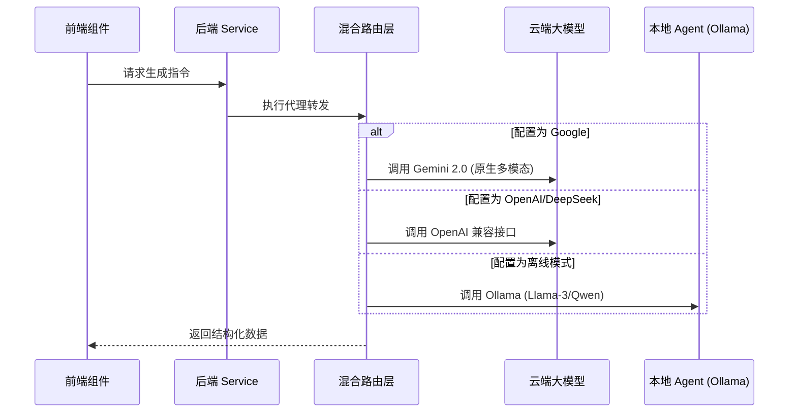

# 🍌 BananaSlides-GenAI (专业版说明文档)

> **新一代混合 AI 引擎驱动的智能演示文稿全链条设计平台**  
> 融合 Google Gemini 2.0 的“视觉原生”能力与 OpenAI 生态的通用逻辑推理，结合 MinerU 高保真文档解析，旨在通过“意图驱动”的设计哲学，将复杂的 PPT 创作过程降维至分钟级响应。

[](https://vitejs.dev/)
[](#)
[](#)
[](#)
[](#)

---

## 📖 核心价值主张 (Value Proposition)

在传统的演示文稿创作中，人类往往在 80% 的重复性排版和素材搜寻中消耗了大量的创造力。**BananaSlides** 致力于通过“感知与生成”的双重迭代，实现以下价值：

- **内容重塑**: 彻底打通“非结构化文档 -> 结构化大纲 -> 详细章节正文”的自动演进链路。
- **视觉一致性**: 独创的 4 层级 Prompt 智能合成算法，确保每一页变体图片都能完美吻合参考图的视觉基因。
- **混合 AI 优势**: 灵活切换 DeepSeek (逻辑)、Gemini Image (审美) 与本地 Llama (安全)，实现成本、速度与质量的最优解。

---

## 👥 用户画像与应用价值矩阵 (Target Users & Matrix)

| 目标角色 (Personas) | 典型业务场景 | BananaSlides 带来的亮点价值 |
| :--- | :--- | :--- |
| **职场精英 (Consultants)** | 竞标方案、周月报、战略分析。 | **快速冷启动**：从一个模糊的主题瞬间生成专业大纲。 |
| **高校科研 (Researchers)** | 学术论文汇报、课题开题。 | **高保真转录**：集成的 MinerU 技术能精准保留论文中的技术术语与逻辑。 |
| **教研培训 (Educators)** | 课程讲义、培训课件。 | **视觉多样性**：一键生成多种排版变体，极大地丰富课件的视觉吸引力。 |
| **开发者 (Engineers)** | 技术方案评审、架构分享。 | **私有化友好**：支持 Ollama 等本地模型接入，保障代码与方案的私密性。 |

---

## 🛠️ 核心功能模块全扫描 (Functional Spectrum)

### 1. 🚀 项目看板 (Intelligent Dashboard)
- **快速创建**: 支持“纯文本描述”或“多语言文档上传”两种创作入口。
- **历史管理**: 级联过滤器系统（系统预设 vs 个人自定义），配合**电影胶片式**的 15 图快速预览系统，让查找历史成果如翻阅相册般丝滑。

### 2. 🎨 全球样式编辑器 (Style Workbench)
- **风格地图 (Style Map)**: 支持为封面、目录、过渡、正文等不同页面类型分别上传参考图。
- **智能调色板**: 动态同步色彩配置，AI 能够“理解”深蓝色系与极简几何风的组合逻辑。
- **实时预览**: 所见即所得的 Web 画布，支持手动微调 AI 生成的内容与变体。

### 3. 📄 高保真文档解析器
- **MinerU 集成**: 区别于常规的 PDF 解析，MinerU 能识别复杂的文档版式，并输出高质量的 Markdown，作为大纲生成的结构化参考。

### 4. 🔄 智能版本控制系统 (Time Machine)
- **快照记录**: 每次重大变更都会自动创建 `ProjectSnapshot`。
- **AI 摘要**: 系统会为每个快照自动概括“做了什么”，如：“将第三页标题修改为‘技术架构图’，并更换了科技感背景”。

---

## 💎 极致交互哲学 (Interaction Design Philosophy)

> 我们不仅仅是在开发一个 PPT 工具，我们是在打磨一种“人机协同”的呼吸感。

### 🌊 交互动画与动效
- **胶囊化导航栏 (Adaptive Header)**:  
  当用户沉浸在编辑区向下滚动时，传统的笨重 Header 会平滑收缩并“流变”成一个带有毛玻璃质感的轻量级**动态胶囊**悬浮在窗口中心。这一设计增加了 15% 的垂直编辑视野，同时减少视觉压迫感。
- **呼吸式反馈**: 所有 AI 生成过程均配有细腻的微动效，缓解用户在等待模型响应期间的焦虑。

### 🧩 级联式过滤交互
- **二层逻辑设计**: 在模板库和历史库中，通过“左侧分类树 + 右侧级联标号”的形式，将“系统标准化样式”与“用户个性化创作”清晰分离，确保管理成千上万个项目依然井然有序。

---

## 🧬 技术深度解析 (Technical Deep-Dive)

### 1. 混合模型路由器 (Router-Adapter)
系统基于适配器模式，实现了一套通用的 AI 路由协议。



### 2. 4 层级智能 Prompt 构建算法
为了确保 AI 生图不跑偏，我们通过一个复杂的构建工厂将指令分为：
- **Layer 1: 视觉基因**: 由 Vision 模型预解析出的参考图关键词（构图、色彩、质感）。
- **Layer 2: 业务语义**: 包含页面标题与基于上下文的 800 字正文。
- **Layer 3: 形神合一指令**: 显式告知 AI 如何将视觉基因与业务语义进行有机“重组”。
- **Layer 4: 工业级参数**: 强制宽高比 (16:9)、4K 分辨率约束、字体清晰度强化。

---

## 🔌 技术栈详情 (Technology Stack)

- **前端架构**: 
  - `React 19` + `Vite 6` (下一代构建工具)
  - `Tailwind CSS v4` (零运行时组件样式)
  - `Tanstack Query v5` (极致的数据流与竞态处理)
  - `Framer Motion` (精细动效引擎)
- **后端架构**: 
  - `Node.js 22 (LTS)` + `Express v5`
  - `Prisma ORM` + `SQLite` (本地数据库极速响应)
- **AI 协议**: 
  - `Google GenAI SDK`
  - `OpenAI Native SDK / Axios Custom Adapter`
  - `MinerU API` (专业文档语义转换)

---

## 🚀 部署与启动指南

### 1. 环境依赖
- **Runtime**: Node.js >= 18.x
- **Package Manager**: npm / pnpm / yarn

### 2. 环境变量 (`server/.env`)
```env
DATABASE_URL="file:./dev.db" # 本地 SQLite 路径
PORT=1111 # 后端端口
GEMINI_API_KEY="AI_STUDIO_KEY" # 核心生成密钥
MINERU_API_KEY="OPTIONAL_KEY" # PDF 解析高级密钥
```

### 3. 运行命令
- **前端启动 (Port 1000)**: `npm run dev`
- **后端启动 (Port 1111)**: `cd server && npm run dev`
- **一键运行 (Windows)**: 直接点击根目录下的 `start_app.bat`。

---

## 📈 未来路线图 (Roadmap)
- [ ] **可视化排版 Agent**: 自动根据文字内容决定图文排列。
- [ ] **多人在线协作**: 基于 WebSocket 的实时实时光标与状态同步。
- [ ] **高阶导出引擎**: 直接输出带有复杂动画路径的 PPTX 物理文件。

---

*BananaSlides: 给演示文稿注入灵魂。*

---

## 📚 附录：深度技术指南 (Deep Dive Guides)

为了保持根目录整洁，详细的技术规约已移至 `docs/specs/` 目录：

- **[数据存储与数据库设计](./docs/specs/DATA_ARCHITECTURE.md)**: 详尽的 Prisma Schema 与同步逻辑说明。
- **[图片生成 Prompt 规范](./docs/specs/SPEC_PROMPT_IMAGE.md)**: 4 层级 Prompt 构建逻辑。
- **[大纲生成规范](./docs/specs/SPEC_PROMPT_OUTLINE.md)**: 页面配比与顺序算法。
- **[开发维护笔记](./docs/specs/DEVELOPER_NOTES.md)**: 核心链路集成与后端路由逻辑。

