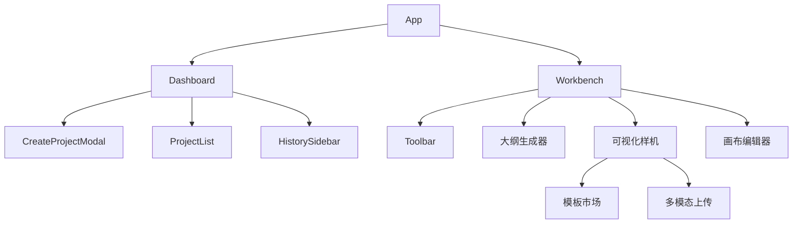

# BananaSlides-GenAI (AI 智能生成 PPT)

> **新一代混合 AI 引擎驱动的智能演示文稿设计平台**。
> 融合 Google Gemini 的多模态能力与 OpenAI 生态的通用性，结合 MinerU 高保真文档解析，打造企业级 PPT 生成体验。


## 🌟 核心特性 (Key Features)

### 1. 🧠 混合 AI 引擎 (Hybrid AI Engine)
- **Router-Adapter 架构**: 动态路由请求至最佳模型（如逻辑推理用 DeepSeek，创意绘图用 Gemini/Flux）。
- **多模态协同**: 文本、图像、视觉理解三大模块解耦，支持自定义组合。
- **低成本高可用**: 内置 fallback 机制，确保服务稳定性。

### 2. 📄 MinerU 高保真解析
- **专业文档理解**: 集成 [MinerU](https://github.com/opendatalab/MinerU) 转换技术，精准提取 PDF/扫描件中的布局、表格与公式。
- **智能语义分块**: 自动识别文档层级，生成结构化大纲。

### 3. 🎨 智能可视化设计 (Visual Designer)
- **Smart Refine**: 基于 LLM 的提示词优化器，将简单指令转化为 Midjourney 级绘图参数。
- **动态排版**: 30+ 种智能布局，根据内容长度自动适配 Font Size 与容器。
- **实时预览**: 所见即所得 (WYSIWYG) 的编辑体验。

## 📸 界面概览 (Gallery)

| 工作台 (Workbench) | 样式库 (Style Library) |
| :---: | :---: |
|  |  |

| 项目列表 (Projects) | 编辑器配置 (Editor) |
| :---: | :---: |
|  |  |

## 🏗️ 架构深度解析 (Architecture Deep Dive)

### 1. 数据模型 (Data Model)
项目基于 `Prisma (SQLite)` 构建了严谨的关系型数据结构，确保数据一致性与可追溯性。

- **Project (项目)**: 核心实体，存储全局配置 (`StyleConfig`) 和状态。
- **Slide (幻灯片)**: 
  - 支持 `PageType` (封面/目录/内容页) 多态设计。
  - `variants`: 存储 AI 生成的多版本视觉方案 (JSON Array)。
  - `originalFileRef`: 记录生成素材的溯源信息。
- **ProjectSnapshot (版本快照)**: 
  - 自动增量备份：每次 AI 生成或重大修改时触发。
  - `summary`: AI 自动生成变更摘要 (如 "Added 3 slides about AI Trends")。
  - 支持一键回滚历史版本。

### 2. 前端组件树 (Frontend Component Tree)
采用 React 19 + Vite 6 构建，核心模块化设计：



## 🚀 高级功能指南 (Advanced Features)

### 🔄 智能版本控制 (Project Snapshots)
系统内置了"时间机器"。在工作台左下角的时间轴中，您可以：
- 查看每次 AI 修改的历史记录。
- 阅读 AI 自动生成的变更摘要。
- 点击任意节点瞬间恢复到该状态，无需担心误操作。

### 🎭 样式模板系统 (Style Templates)
- **系统预设**: 内置 Business, Cyberpunk, Minimalist 等多种风格。
- **自定义模板**: 
  - 支持上传参考图 (Style Reference)。
  - 定义色彩盘 (Color Palette) 和排版规则。
  - 保存后可跨项目复用。

### 🔌 离线/私有化部署 (Local/Offline Mode)
在 `GEMINI.md` 的 "OpenAI Compatible" 模式中，支持接入本地 LLM (如 Ollama, LM Studio)。
- 设置 `Base URL` 为 `http://localhost:11434/v1`。
- 系统会自动识别本地环境，跳过鉴权并优化延迟。

## 🛠️ 技术栈 (Tech Stack)

### Frontend (User Interface)
- **Framework**: React 19, Vite 6
- **Styling**: Tailwind CSS v4, Framer Motion
- **State**: TanStack Query
- **Utilities**: Lucide React, jspdf, pptxgenjs

### Backend (Logic & Data)
- **Runtime**: Node.js, Express v5
- **Database**: SQLite, Prisma ORM
- **AI Integration**: Google GenAI SDK, OpenAI Compatible API
- **Doc Processing**: MinerU API, Mammoth (.docx), Mammoth

## 🚀 快速启动 (Quick Start)

### 1. 后端服务 (Backend)

负责 AI 代理、数据库存取与文件上传。运行在 port `1111`。

```bash
cd server
npm install

# 初始化数据库结构 (包含 Project, Snapshot, Slide 表)
npx prisma migrate dev --name init

# 启动开发服务器
npm run dev
```

### 2. 前端应用 (Frontend)

负责用户界面与交互。运行在 port `1000` (或随机端口)。

```bash
# 在项目根目录下
npm install

# 启动前端
npm run dev
```

## ⚙️ 环境变量配置

请在 `server/.env` 中配置您的密钥：

```env
# Database
DATABASE_URL="file:./dev.db"

# Server Port
PORT=1111

# AI Providers (深度配置见 GEMINI.md)
GEMINI_API_KEY="your-google-api-key"
OPENAI_API_KEY="your-openai-key" # 可选
MINERU_API_KEY="your-mineru-key" # 可选，用于 PDF 解析
```

---

*详细 AI 模型矩阵与路由配置请参阅 [GEMINI.md](./GEMINI.md)*
