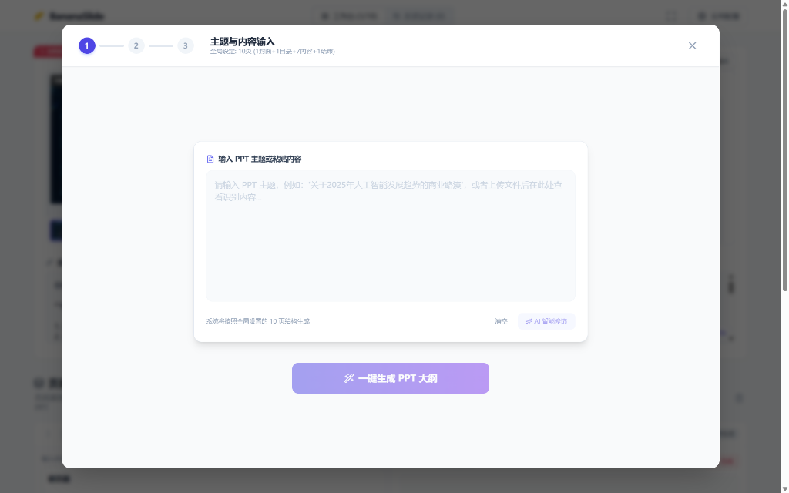
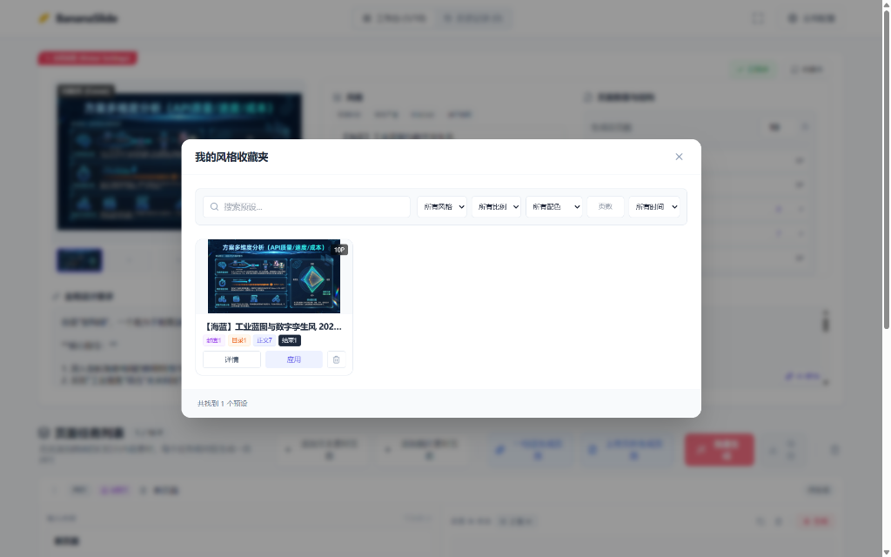

# 🍌 BananaSlides-GenAI: 生产力级 AI 幻灯片自动化创作平台

  
   
  

    
    
  

BananaSlides-GenAI 是一款深度集成 Google Gemini 系列模型及国产多模型生态的下一代 PPT 创作工具。它打破了传统“手动排版”的繁琐，通过 AI 代理协同，实现从原始灵感、参考文档到演示文稿的全链路自动化。

## 🌟 核心功能地图

### 1. 智能策划与内容引擎

- **全自动结构化**：智能识别 PPT 类型（商业计划、述职报告、课程内容等），自动匹配“封面-目录-过渡-内容-结语”的黄金逻辑。
- **深度文案扩充**：告别干瘪的标题，AI 为每页生成 150-250 字的高质量详细描述与关键论点。
- **智能修饰 (Smart Refine)**：一键对原始需求或已有内容进行专业化、精准化的 AI 处理。

### 2. 跨模态视觉设计

- **参考图风格增强**：只需上传一张你喜欢的 PPT 截图，AI 将自动学习并模拟其色彩空间、布局趋势。
- **多变体方案**：每页支持生成多达 9 种不同的视觉方案，总有一款满足你的审美。
- **高分辨率预览**：支持 1K、2K 甚至 4K 的极清页面预览。

### 3. 极致性能与工程化

- **多模型自由组合 (Combo Mode)**：业界领先功能。支持将文本、图像、感知任务分别指派给不同的提供商。
- **并发性能加速**：可灵活配置调用频率，充分压榨 API 配额实现多页面并行生成。
- **响应式工作台**：支持拖拉拽（DnD）重排页面、单页重新生成、实时内容编辑。

### 4. 专业级导出系统

- **原生 PPTX 格式**：生成的图片作为背景，文案作为备注，由 `pptxgenjs` 强力驱动。
- **高清 PDF 预览**：支持 16:9 画幅的高清 PDF 直接导出。
- **批量导出**：一键打包所有生成素材。

## 🛠️ 技术底座

- **前端**: React 19 + Vite 6 + Tailwind CSS
- **AI 系统**: Google GenAI SDK (核心) + OpenAI Compatible Layer
- **交互设计**: Lucide Icons + HSL 动态调色盘 + 高级动画系统

## 📂 文档导航

- **[AGENTS.md](./AGENTS.md)**：深入了解幕后的“内容策略师”与“视觉设计师”如何协作。
- **[GEMINI.md](./GEMINI.md)**：查看本地 API 代理优化、模型并发配置及环境配置项。

## 快速上手

1.  **安装**: `npm install`
2.  **配置**: 在 `.env.local` 写入 `GEMINI_API_KEY`。
3.  **运行**: `npm run dev`
4.  **创作**: 打开浏览器访问 `http://localhost:1000/`。

---

_由 Antigravity 强力驱动，让每一份演示文稿都具备灵动的生命力。_
