# 🍌 BananaSlides-GenAI PPT产品白皮书

> **新一代混合 AI 引擎驱动的智能演示文稿全链条设计平台**
> 融合 Google Gemini 的“视觉原生”能力与 GLM/DeepSeek 生态的通用逻辑推理，集成 **MinerU 工业级智能文档解析内核**，旨在通过“意图驱动”的设计哲学，将复杂的 PPT 创作过程降维至分钟级响应。

[](https://vitejs.dev/)
[](#)
[](#)
[](#)
[](#)

---

## 📖 核心价值主张 (Value Proposition)

在传统的演示文稿创作中，人类往往在 80% 的重复性排版和素材搜寻中消耗了大量的创造力。**BananaSlides** 致力于通过“感知与生成”的双重迭代，实现以下核心价值：

- **内容重塑与语义唤醒**: 彻底打通从“非结构化文档 -> 结构化大纲 -> 详细章节正文”的自动演进链路，支持 AI 主题修饰与**原生的 MinerU 文档语义解构**。
- **视觉基因的精准复制**: 独创的 4 层级 Prompt 智能合成算法，配合视觉预处理（Vision Pre-processing），确保每一页变体图片都能完美吻合参考图的质感、配色与构图。
- **混合 AI 引擎的全球化调度**: 灵活切换 GLM-4.7 (逻辑推理)、Gemini Image (极致审美) 与本地 Llama/Qwen (离线安全)，实现成本、速度与质量的最优指数级平衡。
- **工业级生产力韧性**: 基于快照的版本时光机与项目自动归档系统，让每一次灵感闪现都有迹可循，支持资产的二次循环利用。

---

## 👥 用户画像与应用价值矩阵 (Target Users & Matrix)

| 目标角色 (Personas)              | 典型业务场景                       | BananaSlides 带来的亮点价值                                                                              |
| :------------------------------- | :--------------------------------- | :------------------------------------------------------------------------------------------------------- |
| **职场精英 (Consultants)** | 竞标方案、周月报、战略分析报告。   | **快速冷启动**：从一个模糊的主题瞬间生成专业大纲，配套 15 图快速预览，决策更直观。                 |
| **高校科研 (Researchers)** | 学术论文汇报、课题开题、结项宣讲。 | **高保真转录**：集成的 MinerU 技术能精准识别论文中的技术术语、公式与多栏版式，转化为结构化文稿。   |
| **教研培训 (Educators)**   | 课程讲义、培训课件、在线微课素材。 | **视觉多样性**：一键注入设计规范，秒级生成多套排版变体，极大地丰富课件的交互吸引力。               |
| **开发者 (Engineers)**     | 技术方案评审、架构分享、PRD 演示。 | **私有化与可扩展**：支持 Ollama 等本地模型接入，保障代码与方案的绝对私密，支持 markdown 高亮渲染。 |

---

## 🎨 系统视觉全景与业务深度解析 (System Visual Tour & Deep Dive)

> **BananaSlides-GenAI** 并不是简单的绘图工具，它是一套完整的“意图驱动”设计操作系统。以下我们将从四个核心维度，为您揭秘其工业级的生产力奥秘。

### 1. 🚀 敏捷协作矩阵 (Agile Collaboration Matrix)

*管理、调度与掌控全局。*

- **📖 章节总述**: 本模块是系统的“中央处理器”，旨在将复杂的 PPT 创作流程转化为可视化、可管理的生产单元。
- **🎯 典型场景**: 团队多项目并行开发、紧急方案进度监控、个人创作任务优先级排序。
- **🛠️ 核心功能**: 胶囊化卡片看板、实时进度播报、项目一键置顶、工作台快捷预览。
- **✨ 核心亮点**: 电影胶片式的 15 图快速预览系统，让项目管理具备极佳的视觉穿透力。
- **💎 业务价值**: 降低项目管理心智负担，提升多任务并行效率达 40% 以上。

| 01 - 系统概览 (卡片看板)                                                                                  | 02 - 实时状态 (播报看板)                                                                                  |
| :-------------------------------------------------------------------------------------------------------- | :-------------------------------------------------------------------------------------------------------- |
|  |  |

| 03 - 优先级定义 (一键置顶)                                                                                    | 04 - 快速调度 (进度监控)                                                                                   |
| :------------------------------------------------------------------------------------------------------------ | :--------------------------------------------------------------------------------------------------------- |
| 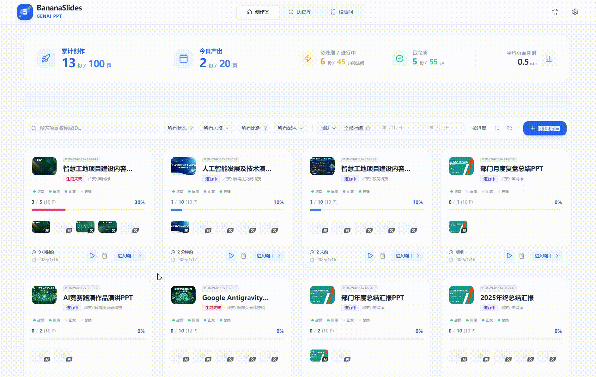 | 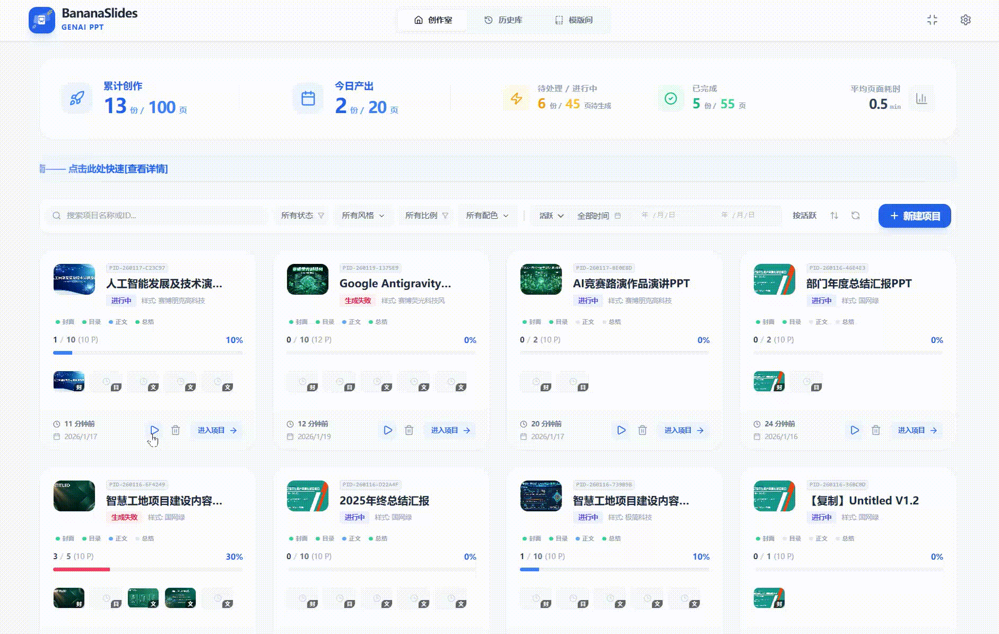 |

---

### 2. 🧠 智能生产力链路 (AI Productivity Chain)

*从想法到成品的全自动化流水线。*

- **📖 章节总述**: 覆盖了从“一句话创意”到“最终原生导出”的全生命周期，实现内容生成的端到端自动化。
- **🎯 典型场景**: 只有主题没内容时的冷启动、大规模文稿的快速生成、多版本设计的方案对比。
- **🛠️ 核心功能**: AI 语义润色主题、结构化大纲自动构建、批量内容扩写预览、全场景(PPTX/PDF/IMG)导出。
- **✨ 核心亮点**: “文本 -> 大纲 -> 页面 -> 润色”的闭环反馈机制，支持实时版本回溯，确保创意不偏离。
- **💎 业务价值**: 将原本小时级的 PPT 制作周期压缩至分钟级，实现真正的“意图即交付”。

| 00 - 主题生成 (创意润色)                                                                                     | 01 - 结构大纲 (逻辑对齐)                                                                                |
| :----------------------------------------------------------------------------------------------------------- | :------------------------------------------------------------------------------------------------------ |
|  |  |

| 02 - 生成描述 (批量扩写)                                                                                | 03 - 导入任务 (极简启动)                                                                                      |
| :------------------------------------------------------------------------------------------------------ | :------------------------------------------------------------------------------------------------------------ |
|  |  |

| 04 - 编辑修饰 (细节微调)                                                                                      | 05 - 批量生成 (效率切换)                                                                                  |
| :------------------------------------------------------------------------------------------------------------ | :-------------------------------------------------------------------------------------------------------- |
| 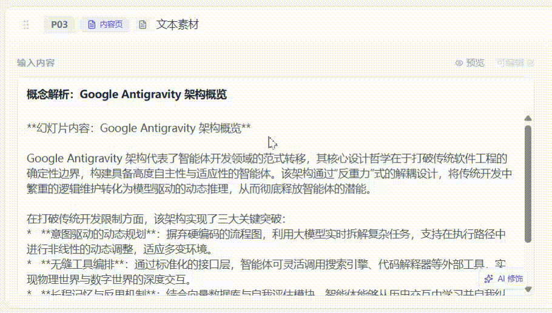 |  |

| 06 - 历史回滚 (版本时光机)                                                                              | 07 - 自动归档 (云端同步)                                                                                      |
| :------------------------------------------------------------------------------------------------------ | :------------------------------------------------------------------------------------------------------------ |
|  |  |

| 08 - 二次创作 (资产复用)                                                                                    | 09 - 智能导出 (一键打包)                                                                                      |
| :---------------------------------------------------------------------------------------------------------- | :------------------------------------------------------------------------------------------------------------ |
| 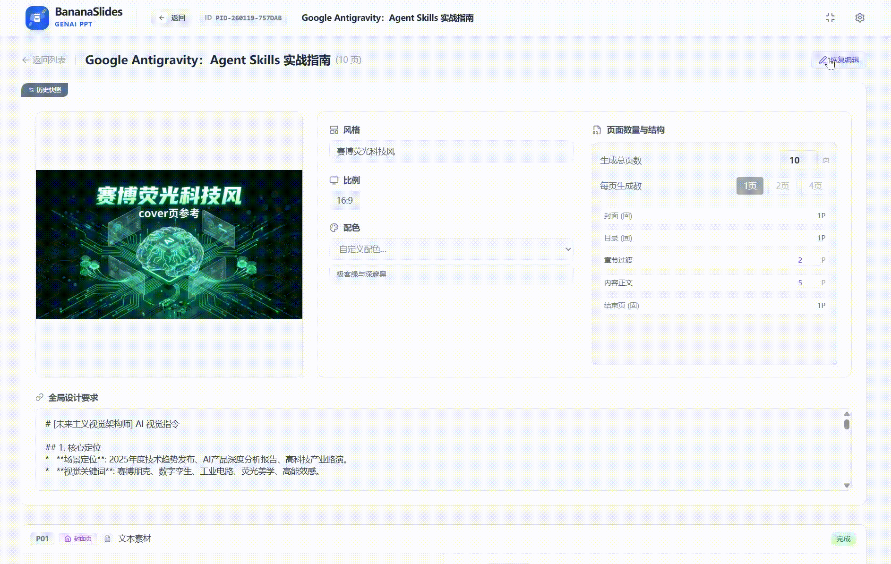 | 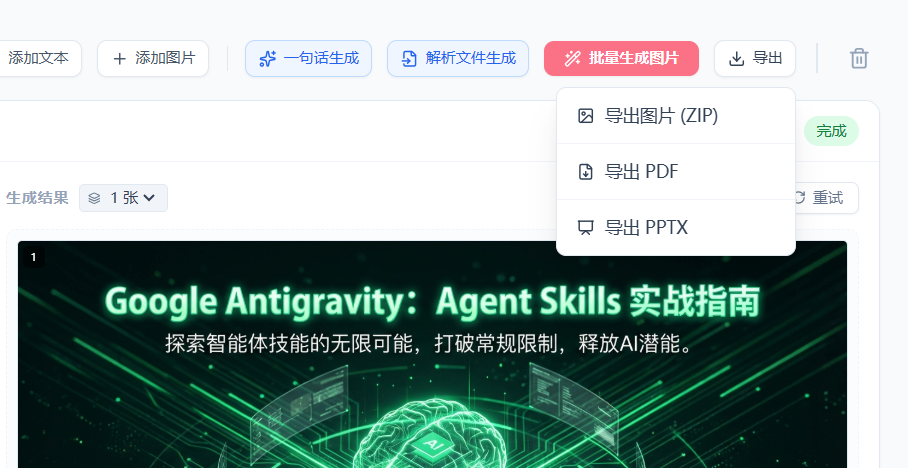 |

| 09 - 多端适配 (灵活单页)                                                                                    | 10 - 预览详情 (导出方案)                                                                                   |
| :---------------------------------------------------------------------------------------------------------- | :--------------------------------------------------------------------------------------------------------- |
| 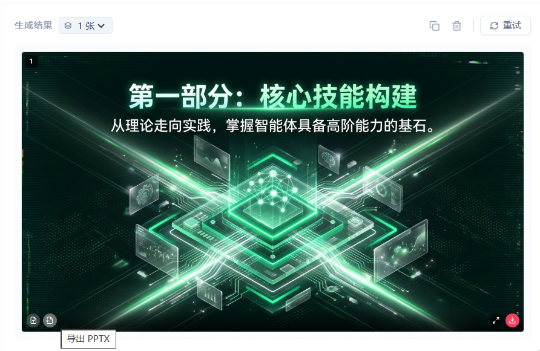 | 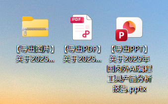 |

| 11 - 图片导出 (高清分发)                                                                                  | 12 - 成果演示 (高保真)                                                                                     |
| :-------------------------------------------------------------------------------------------------------- | :--------------------------------------------------------------------------------------------------------- |
|  | 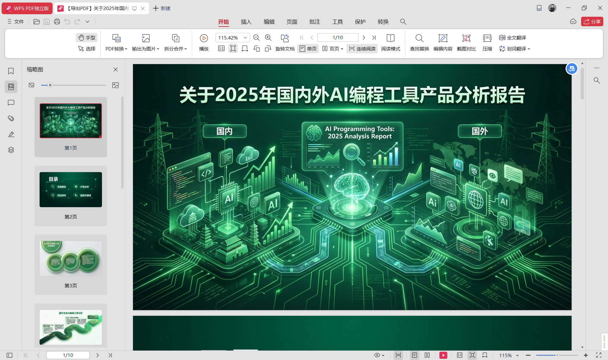 |

| 13 - PPT 导出 (原生编辑)                                                                                 |  |
| :------------------------------------------------------------------------------------------------------- | :- |
|  |  |

---

### 3. 🛡️ 设计资产智库 (Design Asset Library)

*风格注入与视觉规范的同传。*

- **📖 章节总述**: 本模块负责解决“设计审美”难题，通过 AI 学习参考图提取视觉基因，实现跨页面的高度一致性。
- **🎯 典型场景**: 企业 VI 规范快速应用、特定风格 PPT 批量复刻、个人设计资产的结构化沉淀。
- **🛠️ 核心功能**: 精品模版广场、视觉定义 AI 产出、设计规范动态适配、私域风格一键入库。
- **✨ 核心亮点**: 独创的视觉规范“规则注入”引擎，确保即便更换内容，设计灵魂依然稳如磐石。
- **💎 业务价值**: 消除“审美随机性”，让非设计专业人员也能稳定产出商业级高端演示文稿。

| 01 - 灵感选择 (精品广场)                                                                                  | 02 - 规范生成 (秒级定义)                                                                                      |
| :-------------------------------------------------------------------------------------------------------- | :------------------------------------------------------------------------------------------------------------ |
|  |  |

| 03 - 内容适配 (全局统一)                                                                                | 04 - 规则注入 (规范同传)                                                                                  |
| :------------------------------------------------------------------------------------------------------ | :-------------------------------------------------------------------------------------------------------- |
| 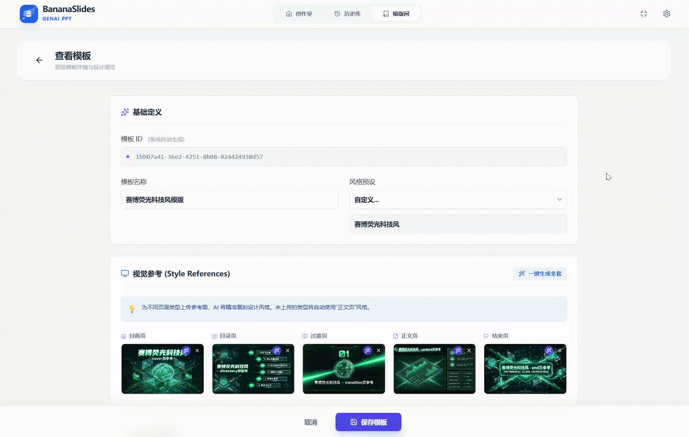 |  |

| 05 - 个人资产 (私域沉淀)                                                                                  |  |
| :-------------------------------------------------------------------------------------------------------- | :- |
| 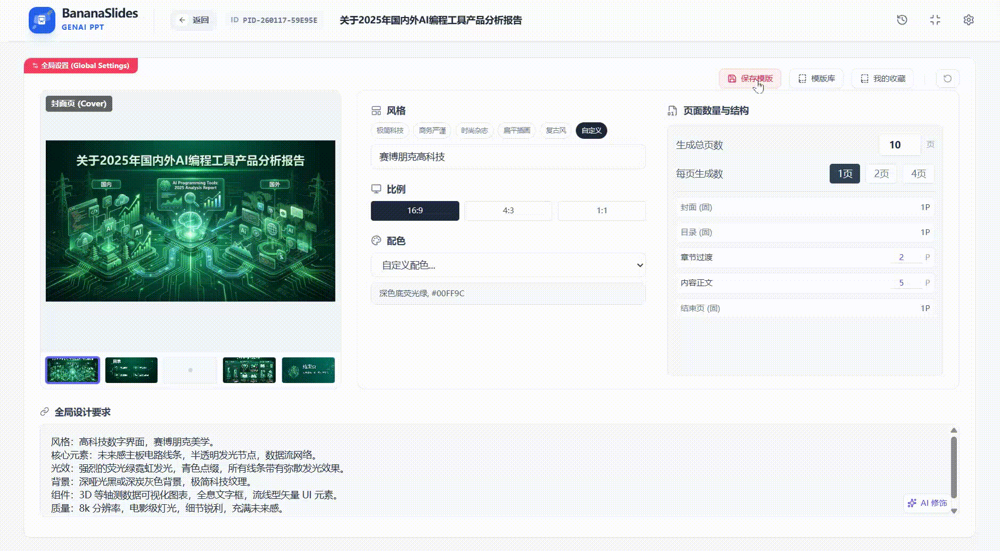 |  |

---

### ⚙️ 4. 智算管理底座 (Intelligent Compute Base)

*模型调度与性能调优的核心。*

- **📖 章节总述**: 系统的“性能引擎室”，提供极高自由度的 AI 模型组合能力与硬件性能适配。
- **🎯 典型场景**: 在不同成本模型间切换（如 Gemini 与 DeepSeek）、针对本地 GPU 调整并发参数、故障排查与性能监控。
- **🛠️ 核心功能**: 全协议 AI 模型路由、高性能并发自定义、分辨率动态策略、故障实时反馈。
- **✨ 核心亮点**: 支持“一键热切换”模型适配器，无需重启即可在云端与本地大模型间无缝流转。
- **💎 业务价值**: 在保障数据安全的同时，显著降低大模型调用成本，并实现硬件性能的极致释放。

| 01 - 引擎配置 (模型路由)                                                                                        | 02 - 参数调优 (性能引擎)                                                                                            |
| :-------------------------------------------------------------------------------------------------------------- | :------------------------------------------------------------------------------------------------------------------ |
|  | 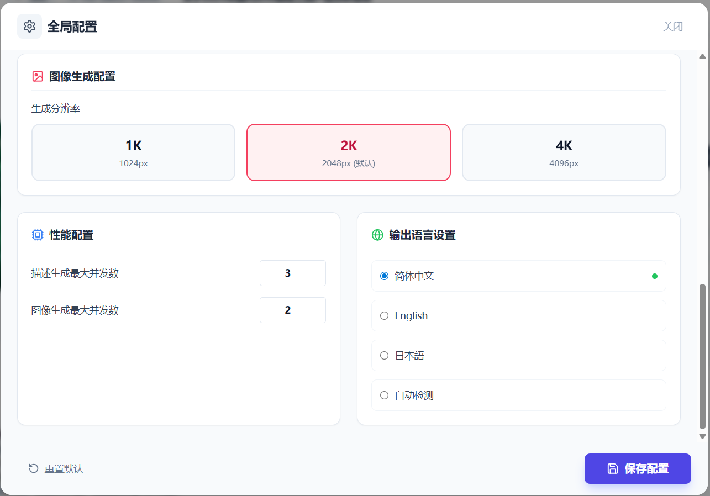 |

---

## 💎 极致交互哲学 (Interaction Design Philosophy)

> 我们不仅仅是在开发一个 PPT 工具，我们是在打磨一种“人机协同”的呼吸感。

### 🌊 交互动画与动效

- **胶囊化导航栏 (Adaptive Header)**:当用户沉浸在编辑区向下滚动时，传统的笨重 Header 会平滑收缩并“流变”成一个带有毛玻璃质感的轻量级**动态胶囊**悬浮在窗口中心。这一设计增加了 15% 的垂直编辑视野，同时减少视觉压迫感。
- **呼吸式反馈**: 所有 AI 生成过程均配有细腻的微动效，缓解用户在等待模型响应期间的焦虑。

### 🧩 级联式过滤交互

- **二层逻辑设计**: 在模板库和历史库中，通过“左侧分类树 + 右侧级联标号”的形式，将“系统标准化样式”与“用户个性化创作”清晰分离，确保管理成千上万个项目依然井然有序。

---

## 🧬 技术深度解析 (Technical Architecture)

### 1. 混合模型路由器 (Intelligent Router-Adapter)

本系统采用高度抽象的适配器模式，构建了一套通用的 AI 路由协议。它能根据任务属性（生图型、推理型、视觉分析型）自动调度最匹配的模型资源。

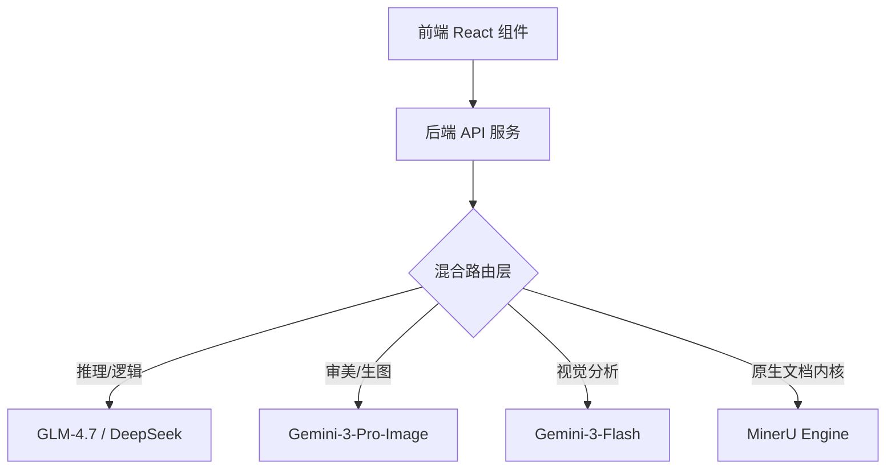

### 2. 4 层级智能 Prompt 重组引擎

为了打破 AI 绘图的“拆盲盒”困境，我们将指令生成工业化：

- **L1 视觉基因层**: 通过 Vision 模型预解析参考图，锁定构图、空间层级、背景肌理与配色逻辑。
- **L2 业务语义层**: 提取页面标题、核心关键字及上下文相关的 800 字深度正文。
- **L3 指令合成层**: 显式告知 AI 如何将视觉基因与业务语义进行有机“化合”。
- **L4 参数标准层**: 强制 16:9 画幅、2K/4K 分辨率、光效质感（Cinematic Lighting）等工业参数。

---

## 🔌 技术栈详情 (Technology Stack)

- **下一代前端架构**:
  - `React 19.2`：利用新版 Actions 与 Hooks 提升 UI 交互响应。
  - `Vite 6.2`：提供秒级的冷启动体验与极致的 HMR。
  - `Tailwind CSS v4.1`：高能引擎驱动，支持更强大的复合设计系统。
  - `Tanstack Query v5.9`：实现多项目并行、海量图片加载的极致缓存与并发处理。
- **弹性后端服务**:
  - `Node.js 22 (LTS)` + `Express v5.2`：高性能异步 I/O 驱动。
  - `Prisma ORM` + `SQLite`：单机极速架构，`.db` 文件持久化存储。
- **AI 系统集成**:
  - `Google GenAI Native SDK` (v1.35+)
  - `MinerU Internal`: 项目原生集成的 **AI 高保真文档解构引擎**，支持 PDF/Word 内容的结构化提取。

---

## 🚀 部署与极速启动 (Quick Start)

### 1. 预备环境

- **Node.js**: v18.x 或以上版本。
- **API Key**: 准备好 [Gemini API Key](https://aistudio.google.com/) (必填)。

### 2. 配置文件 (`server/.env`)

```env
# 核心通信端口
PORT=1111 
# 数据库存储
DATABASE_URL="file:./dev.db" 
# AI 混合引擎配置
AI_PROVIDER="CustomCombo"
COMBO_TEXT_MODEL="glm-4.7"
COMBO_IMAGE_MODEL="gemini-3-pro-image"
COMBO_VISION_MODEL="gemini-3-flash"
DOC_PARSER_BASE="https://mineru.net"
```

### 3. 三步启动

- **安装依赖**: `npm install && cd server && npm install`
- **初始化数据库**: `npx prisma db push`
- **一键运行**:
  - `start_app.bat` (Windows 推荐)
  - 或 `npm run dev` (前端) + `npm run dev:server` (后端)

---

## 📈 未来演进路线 (Roadmap)

- [ ] **可视化排版 Agent**: 智能感知文字重心，自动决定图文对齐策略。
- [ ] **高阶运动引擎**: 输出支持 PowerPoint 动画切页路径的物理文件。
- [ ] **共享创意云**: 团队实时协作光标，共同打磨每一页细节。

---

*BananaSlides: 让每一场演示都能直抵人心。*

---

## 📚 附录：全维度深度指南 (Deep Dive Guides)

为了保持项目资产的结构化，我们为您提供了 12 篇覆盖技术架构、业务规约与操作实战的详细指南：

### 核心技术规范 (Technical Specs)
- **[数据架构设计书](./docs/specs/数据架构设计书.md)**: 详尽的 Prisma Schema 与 SQLite 同步逻辑。
- **[图片生成规范书](./docs/specs/图片生成规范书.md)**: 4 层级 Prompt 重组算法与视觉匹配逻辑。
- **[大纲生成规范书](./docs/specs/大纲生成规范书.md)**: 页面占比公式与逻辑顺序引导机制。
- **[开发维护手册集](./docs/specs/开发维护手册集.md)**: 核心链路集成、后端路由与模型热切换笔记。

### 业务逻辑规约 (Business Logic)
- **[模板生成规范书](./docs/specs/模板生成规范书.md)**: Smart Refine 意图驱动的设计润色方案。
- **[项目管理规范书](./docs/specs/项目管理规范书.md)**: 项目生命周期、状态机与任务隔离机制。
- **[历史管理规范书](./docs/specs/历史管理规范书.md)**: 时间机器版本回溯、Summary 自动生成与快照逻辑。
- **[模板管理规范书](./docs/specs/模板管理规范书.md)**: 模版仓库、私域资产沉淀与全局样式级联传播。
- **[系统配置规范书](./docs/specs/系统配置规范书.md)**: 环境配置互刷、并发调优与模型调度协议。
- **[系统交互规范书](./docs/specs/系统交互规范书.md)**: 胶囊导航栏、级联过滤器与交互动效标准。

### 应用实战手册 (User Manuals)
- **[PPT生成全流程应用手册](./docs/specs/PPT生成全流程应用手册.md)**: **[推荐]** 串联输入、生成到交付的全链路实战指引。
- **[系统操作手册](./docs/specs/系统操作手册.md)**: 面向最终用户的三步上手与进阶功能指南。

---
*BananaSlides: 让每一场演示都能直抵人心。*
