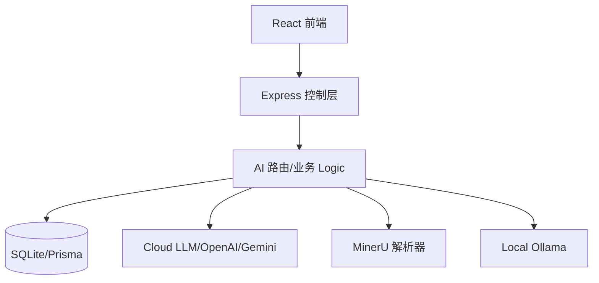

# 产品设计文档 (PRD) - BananaSlides-GenAI

## 1. 文档概述

### 1.1 文档目的
本文档旨在详述 BananaSlides-GenAI 项目的产品设计规范与技术实现逻辑。文档基于现有项目代码库（前端 React/Vite、后端 Node/Express/Prisma）及核心 AI 引擎集成逻辑反推生成，旨在为项目维护、功能迭代及原型设计提供标准参考。

### 1.2 文档范围
- **包含范围**: 智能看板（项目管理）、全球样式编辑器（模版与样式控制）、文档解析系统（MinerU 集成）、AI 辅助 PPT 大纲与内容生成、4层级 Prompt 智能生图算法、版本控制系统（快照记录）。
- **不包含范围**: 物理 PPTX 文件的高级导出效果（动画等）、多端适配、离线客户端。

### 1.3 目标读者
- **主要读者**: 开发团队（前端、后端、AI 工程师）、测试团队。
- **次要读者**: 产品经理、项目管理人员。

### 1.4 术语定义
- **Vision 预处理**: 使用视觉大模型分析参考图的构图与风格。
- **4层级 Prompt**: 结合视觉基因、业务语义、形神合一指令与技术规格的结构化指令系统。
- **MinerU**: 高保真文档解析服务，用于将 PDF/Word 转换为 Markdown 大纲。
- **StyleMap**: 页面类型（封面、目录等）与对应视觉风格参考图的映射关系。

### 1.5 需求承接说明
- **来源版本**: v1.0.0 (基于 2026-01-19 最新代码库)
- **需求一致性声明**: 本文档完全复刻代码库中已实现的“意图驱动”设计哲学及其混合 AI 路由架构。

## 2. 功能模块拆解

### 2.1 系统架构图

### 2.2 功能模块清单

#### 2.2.1 智能看板 (Intelligent Dashboard)
- **模块编码**: BS-DASH-01
- **功能描述**: 项目管理中心。支持模糊搜索、分类管理（系统/自定义）、项目状态追踪。
- **优先级**: 高
- **关键点**: 电影胶片式 15 图快速预览系统，瀑布流展示项目快照。

#### 2.2.2 全球样式编辑器 (Style Workbench)
- **模块编码**: BS-STYLE-02
- **功能描述**: 定义 PPT 整体调性。包含风格地图 (Style Map) 上传、调色板预设、宽高比控制。
- **优先级**: 高
- **集成**: 与 `StyleTemplate` 数据库实体联动，支持收藏与模版化复用。

#### 2.2.3 AI 核心引擎 (Gen-AI Core)
- **模块编码**: BS-AI-03
- **功能描述**: 驱动整个 PPT 内容与视觉的生成。包含智能调优、大纲生成、单页正文扩充、视觉变量渲染。
- **优先级**: 极高
- **技术**: 混合模型路由 (Router-Adapter)，支持 Gemini 2.0 原生多模态。

#### 2.2.4 高保真文档解析 (DocParser)
- **模块编码**: BS-DOC-04
- **功能描述**: 将非结构化文档（PDF/Word）精准转换为 PPT 生成可用的结构化原文。
- **优先级**: 中
- **集成**: 集成 MinerU API，支持复杂版式识别。

## 3. 页面流程设计

### 3.1 业务流程图

### 3.2 页面结构图
- **Landing Page**: 价值主张展示与引导。
- **Dashboard**: 项目列表、模版库、个人中心。
- **Workbench**: 核心编辑区，包含左侧大纲编辑、中间视觉预览、右侧样式控制、底部版本历史。

## 4. 交互逻辑定义

### 4.1 交互设计原则
- **动态呼吸感**: AI 生成过程配有细腻的微动效，防止用户焦虑。
- **胶囊化导航**: 编辑区滚动时 Header 收缩为流体胶囊，释放空间。
- **实时同步**: Tanstack Query 驱动的状态同步，确保多组件数据一致。

### 4.2 核心交互流程: 图片生成 (视觉变体)
1. **Vision 提取**: 首先分析参考图，提取构图骨架与配色。
2. **逻辑合成**: 将参考特征与本页正文内容结合。
3. **分层分发**: 发送至混合路由，根据负载与配置分配至 DALL-E 3 或 Flux。

## 5. 数据字段定义

### 5.1 核心业务实体
| 实体 | 描述 | 关键字段 |
| :--- | :--- | :--- |
| **Project** | 项目根节点 | title, status, globalConfig, styleMap |
| **Slide** | 单页幻灯片 | title, content, pageType, variants, status |
| **ProjectSnapshot** | 版本快照 | version, summary, data (完整状态副本) |
| **StyleTemplate** | 视觉模版 | config, usageCount, favorateCount |

### 5.2 数据字典 (部分)
- **ProjectStatus**: `idle` (空闲), `generating` (生成中), `completed` (完成), `error` (异常)。
- **PageType**: `cover` (封面), `directory` (目录), `transition` (过渡), `content` (正文), `end` (封底)。

## 6. 接口需求说明

### 6.1 核心内部 API
- `POST /api/doc-parser/parse`: 文档解析入口。
- `POST /api/ai/generate-outline`: 大纲生成。
- `POST /api/ai/generate-slide-variant`: 处理复杂的 Vision + Content 渲染请求。

### 6.2 外部 AI 适配器规范
- 兼容 OpenAI 格式指令输入。
- 支持 Gemini SDK 原生 parts 结构（用于多模态传参）。

## 7. 验收标准对接

### 7.1 功能验收标准
- **冷启动响应**: 输入简单主题后，30秒内必须形成初步大纲。
- **视觉一致性**: 生成的图片与参考图的色系重合度、构图相似度应在肉眼感知上保持一致。
- **持久化**: 页面刷新后，所有的编辑状态及 AI 生成结果必须从 SQLite 准确恢复。

### 7.2 性能验收标准
- **前端渲染**: 大项目预览（30页+）不应出现卡顿（FPS > 30）。
- **并发控制**: 支持多页面并行生成（默认为 3-5 并发）。

## 8. 非功能性需求
- **安全性**: 敏感 API Key 必须加密存储或通过服务端环境变量隔离，不应暴露给前端。
- **离线能力**: 如果配置了本地 Llama 模型，系统应在无外网环境下保证核心文本处理能力。

## 9. 附录
- **参考规范**: `docs/specs/DATA_ARCHITECTURE.md`
- **变更历史**: v1.0.0 (2026-01-19) - 初始版本。
