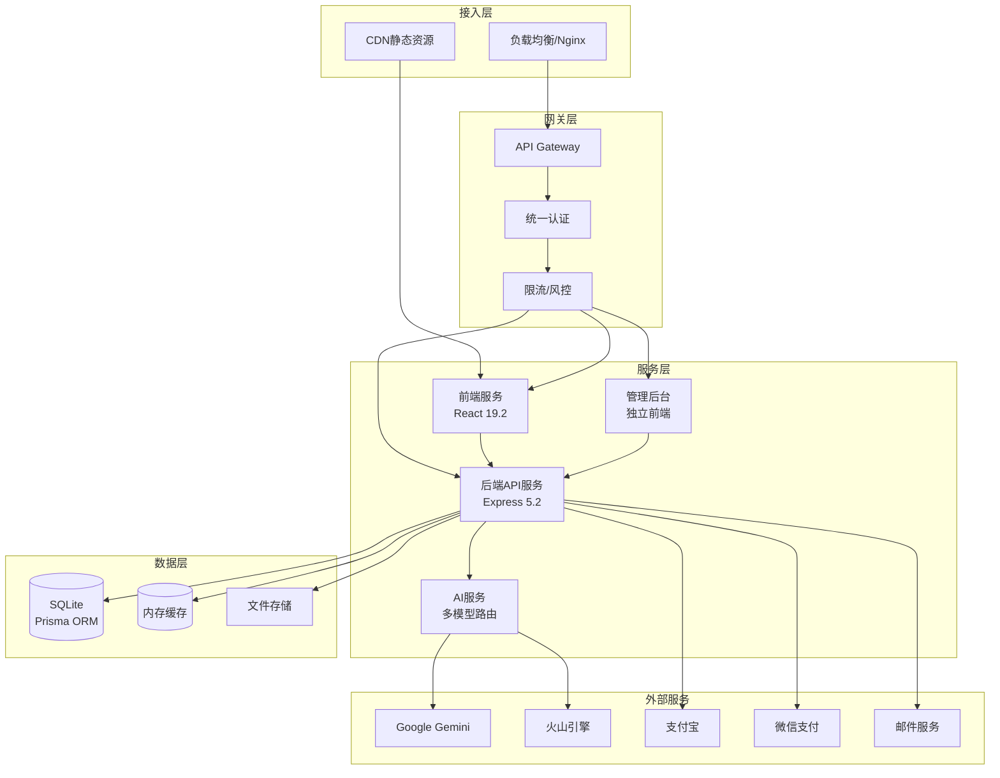
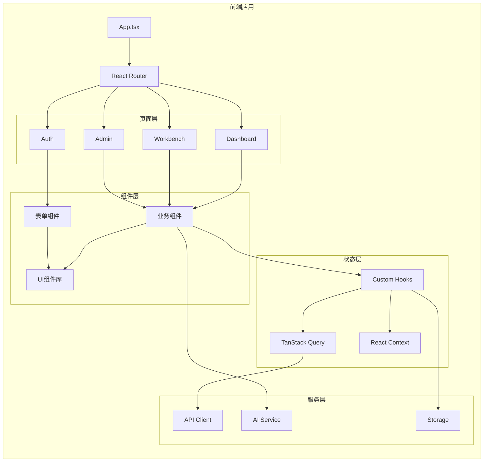
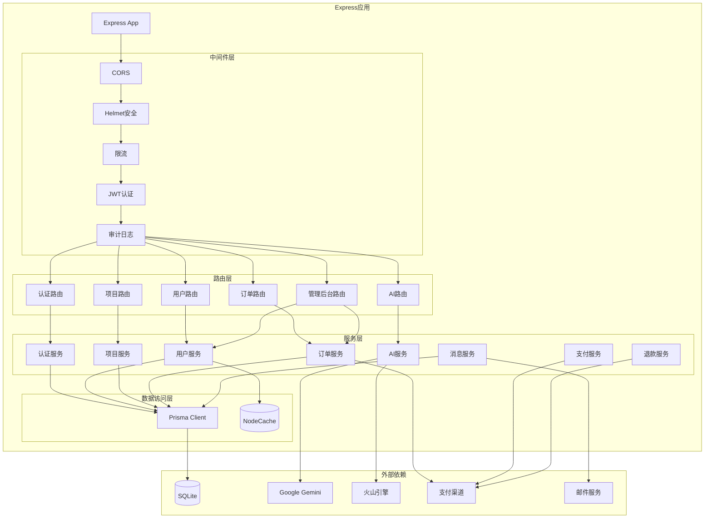
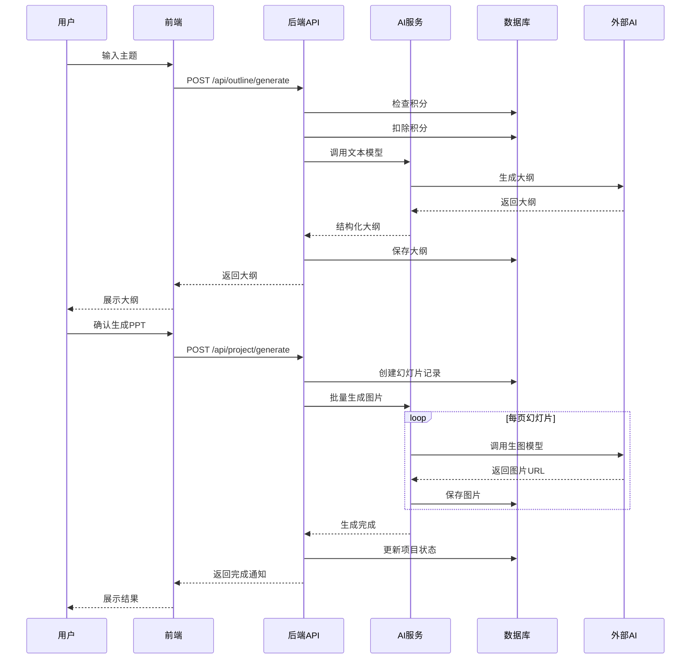
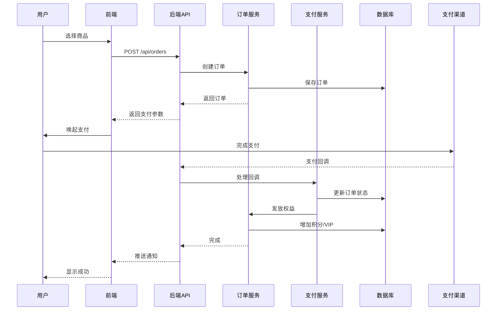
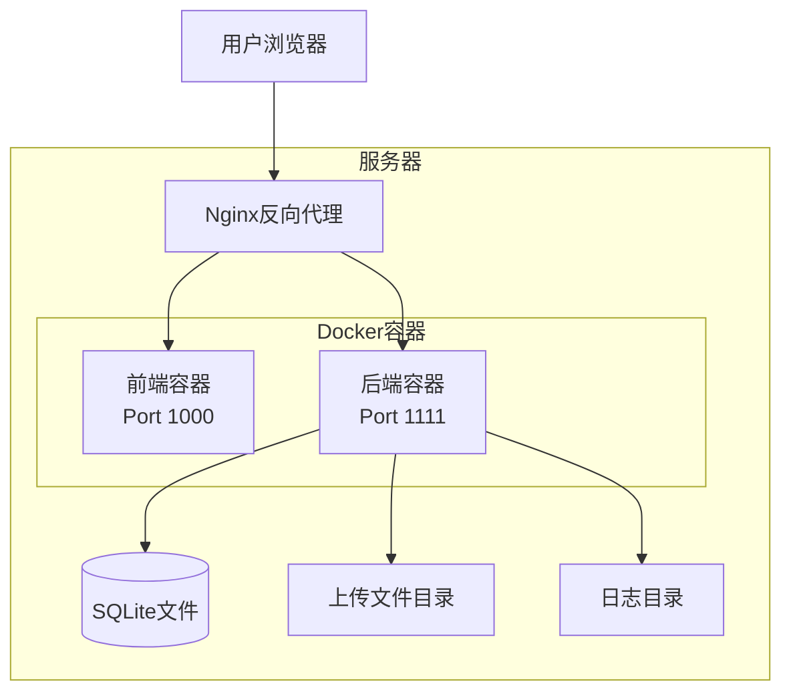
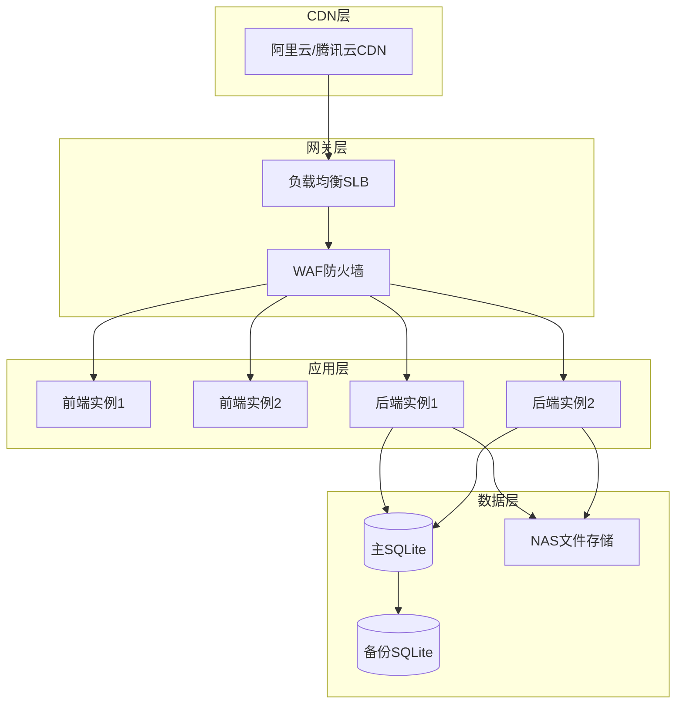

# 🏗️ YH-AI PPT 系统架构概述

> **文档状态**: ✅ 已发布  
> **版本**: v2.0 (与PRD v2.0对齐)  
> **最后更新**: 2026-02-16  

本文档提供YH-AI PPT系统的整体架构视图，包括分层架构、核心组件关系、数据流向等宏观设计。

---

## 1. 架构总览

### 1.1 系统分层架构

### 1.2 核心架构特征

| 特征 | 描述 | 技术实现 |
|------|------|----------|
| **前后端分离** | 独立部署、独立开发 | React SPA + RESTful API |
| **微服务化** | AI服务独立部署 | 独立AI路由服务 |
| **多层安全** | 认证/授权/风控分层 | JWT + RBAC + 风控中间件 |
| **数据一致性** | 事务保证 | SQLite + Prisma事务 |
| **缓存策略** | 多级缓存 | 内存缓存 + 浏览器缓存 |

---

## 2. 核心组件关系

### 2.1 前端架构

**前端技术栈**:
- **框架**: React 19.2 + TypeScript 5.9
- **路由**: React Router v7
- **状态**: TanStack Query v5.9 + React Context
- **样式**: Tailwind CSS v4.1
- **构建**: Vite 6.2

### 2.2 后端架构

**后端技术栈**:
- **框架**: Express 5.2 + Node.js 22
- **ORM**: Prisma 6.19
- **数据库**: SQLite 3
- **缓存**: NodeCache
- **日志**: Winston 3.19
- **验证**: Zod 4.3

---

## 3. 数据流向

### 3.1 典型业务流程

#### 3.1.1 PPT生成流程

#### 3.1.2 订单支付流程

---

## 4. 部署架构

### 4.1 单机部署模式

### 4.2 推荐生产部署

---

## 5. 扩展性设计

### 5.1 水平扩展能力

| 组件 | 扩展方式 | 状态 |
|------|---------|------|
| **前端** | CDN + 多实例 | ✅ 支持 |
| **后端API** | 负载均衡 + 多实例 | ✅ 支持 |
| **数据库** | 读写分离（SQLite限制） | ⚠️ 需迁移 |
| **文件存储** | NAS/OSS | ✅ 支持 |
| **AI服务** | 独立服务 + 队列 | ✅ 支持 |

### 5.2 未来演进方向

1. **数据库迁移**: SQLite → PostgreSQL（支持更高并发）
2. **缓存升级**: 本地缓存 → Redis集群
3. **消息队列**: 引入RabbitMQ/Kafka处理异步任务
4. **微服务拆分**: 将AI服务、支付服务独立部署

---

## 6. 相关文档

- [02_技术架构](./02_技术架构.md) - 详细技术栈和框架选型
- [03_业务架构](./03_业务架构.md) - 业务模块划分和流程设计
- [04_安全架构](./04_安全架构.md) - 安全设计和防护机制
- [../03_Database/01_完整数据字典.md](../03_Database/01_完整数据字典.md) - 数据模型设计
- [../05_API/01_REST_API/核心接口文档.md](../05_API/01_REST_API/核心接口文档.md) - API规范

---

**文档版本**: v2.0  
**最后更新**: 2026-02-16  
**维护者**: 技术架构团队
