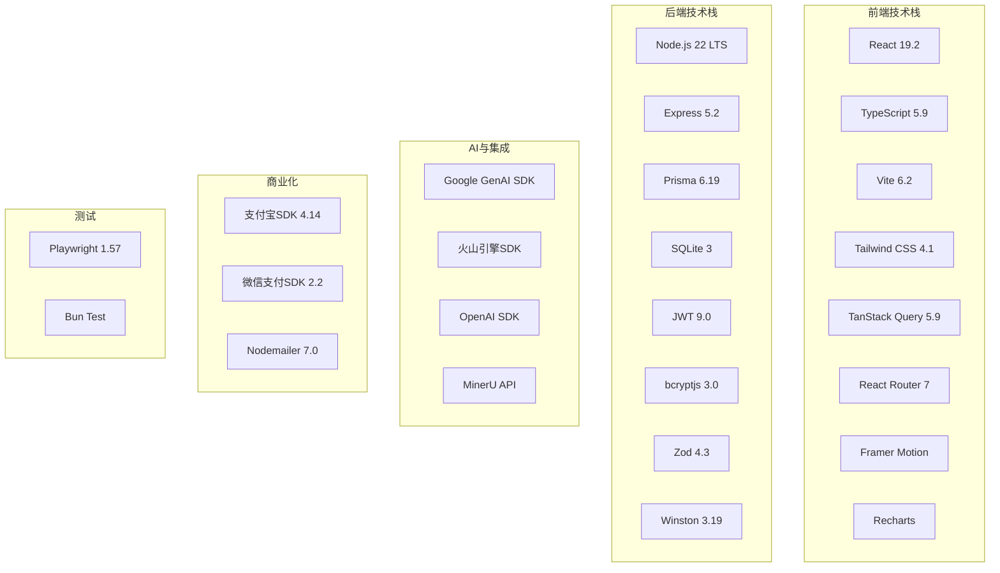
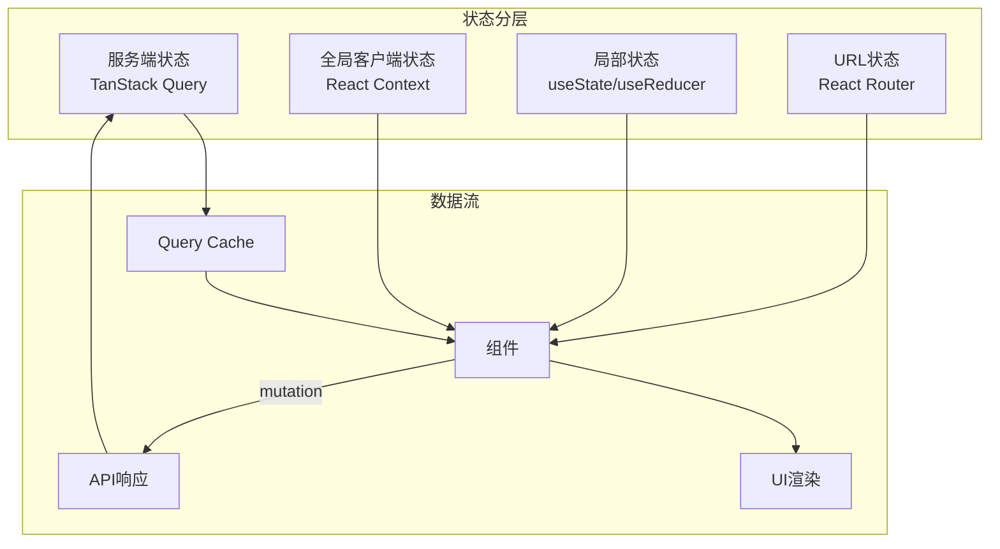
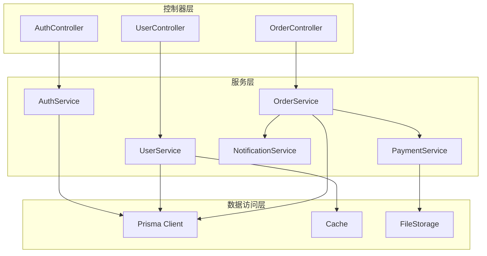
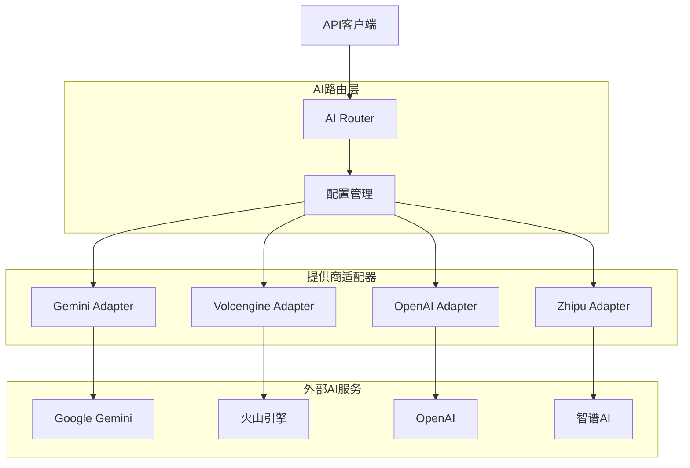

# 🔧 YH-AI PPT 技术架构

> **文档状态**: ✅ 已发布  
> **版本**: v2.0 (与PRD v2.0对齐)  
> **最后更新**: 2026-02-16  

本文档详细说明YH-AI PPT系统的技术栈选择、框架配置和技术决策依据。

---

## 1. 技术栈总览

### 1.1 核心技术栈



### 1.2 版本锁定

| 技术 | 版本 | 锁定原因 |
|------|------|----------|
| React | 19.2 | 稳定版本，支持并发特性 |
| Node.js | 22.x LTS | 长期支持，性能优化 |
| Express | 5.2 | 最新稳定版，支持async/await |
| Prisma | 6.19 | ORM稳定性，支持SQLite |
| Tailwind | 4.1 | v4重大更新，性能提升 |

---

## 2. 前端技术架构

### 2.1 项目结构

```
src/
├── api/                    # API客户端
│   ├── client.ts          # Axios实例配置
│   ├── auth.ts            # 认证相关API
│   ├── project.ts         # 项目相关API
│   └── ...
├── components/            # React组件
│   ├── admin/             # 管理后台组件
│   ├── auth/              # 认证组件
│   ├── common/            # 通用组件
│   └── user/              # 用户端组件
├── contexts/              # React Context
│   ├── AuthContext.tsx    # 认证上下文
│   └── ToastContext.tsx   # 消息提示上下文
├── hooks/                 # 自定义Hooks
│   ├── useAuth.ts         # 认证Hook
│   ├── useProjects.ts     # 项目数据Hook
│   └── useMutation.ts     # 通用Mutation Hook
├── pages/                 # 页面组件
│   ├── Dashboard.tsx      # 工作台
│   ├── Workbench.tsx      # 编辑器
│   └── Admin/             # 管理后台页面
├── services/              # 业务服务
│   ├── ai.service.ts      # AI生成服务
│   ├── export.service.ts  # 导出服务
│   └── upload.service.ts  # 上传服务
├── styles/                # 样式文件
├── types.ts               # TypeScript类型定义
└── utils.ts               # 工具函数
```

### 2.2 状态管理策略



**状态管理原则**:
1. **服务端状态**: 使用TanStack Query管理，支持缓存、重试、刷新
2. **全局状态**: 使用React Context管理用户、主题等全局数据
3. **局部状态**: 使用useState/useReducer管理组件内部状态
4. **URL状态**: 使用React Router管理路由参数、筛选条件

### 2.3 组件设计规范

#### 组件分类

| 类型 | 命名规范 | 示例 | 说明 |
|------|---------|------|------|
| **页面组件** | PascalCase | `Dashboard.tsx` | 路由级别组件 |
| **业务组件** | PascalCase | `ProjectCard.tsx` | 可复用业务组件 |
| **基础组件** | PascalCase | `Button.tsx` | 原子级UI组件 |
| **Hooks** | camelCase + use | `useProjects.ts` | 自定义逻辑复用 |

#### 组件通信方式

```typescript
// 1. Props传递（父子通信）
interface ProjectCardProps {
  project: Project;
  onDelete: (id: string) => void;
}

// 2. Context（跨层级通信）
const AuthContext = createContext<AuthContextType>(null!);

// 3. 状态提升（兄弟通信）
// 将状态提升到共同父组件

// 4. 事件总线（特殊场景）
// 使用mitt库进行组件间事件通信
```

### 2.4 性能优化策略

| 优化手段 | 实现方式 | 适用场景 |
|---------|---------|---------|
| **代码分割** | React.lazy + Suspense | 路由级别懒加载 |
| **组件缓存** | React.memo | 纯展示组件 |
| **虚拟列表** | react-window | 长列表渲染 |
| **图片优化** | WebP格式 + 懒加载 | 图片展示 |
| **请求缓存** | TanStack Query | API数据缓存 |
| **防抖节流** | useDebounce/useThrottle | 搜索输入、滚动事件 |

---

## 3. 后端技术架构

### 3.1 项目结构

```
server/
├── src/
│   ├── app.ts              # Express应用入口
│   ├── config/             # 配置文件
│   │   ├── database.ts     # 数据库配置
│   │   ├── ai.ts           # AI引擎配置
│   │   └── payment.ts      # 支付配置
│   ├── middlewares/        # Express中间件
│   │   ├── auth.ts         # JWT认证
│   │   ├── error.ts        # 错误处理
│   │   ├── rateLimit.ts    # 限流
│   │   └── audit.ts        # 审计日志
│   ├── routes/             # 路由定义
│   │   ├── auth.routes.ts
│   │   ├── user.routes.ts
│   │   ├── project.routes.ts
│   │   └── ...
│   ├── services/           # 业务服务
│   │   ├── ai.service.ts   # AI生成服务
│   │   ├── auth.service.ts # 认证服务
│   │   ├── order.service.ts # 订单服务
│   │   └── ...
│   ├── models/             # 数据模型（Prisma）
│   ├── utils/              # 工具函数
│   └── types/              # TypeScript类型
├── prisma/
│   ├── schema.prisma       # 数据库Schema
│   └── migrations/         # 迁移文件
├── tests/                  # 测试文件
├── scripts/                # 脚本文件
└── package.json
```

### 3.2 中间件链设计

```typescript
// 中间件加载顺序（从先到后）
app.use(helmet());           // 1. 安全头部
app.use(cors());             // 2. 跨域
app.use(express.json());     // 3. Body解析
app.use(requestLogger);      // 4. 请求日志
app.use(rateLimiter);        // 5. 限流保护
app.use(authMiddleware);     // 6. 认证（部分路由）
app.use(auditLogger);        // 7. 审计日志
app.use(routes);             // 8. 业务路由
app.use(errorHandler);       // 9. 错误处理
```

### 3.3 服务层设计

#### 服务分层原则



**服务设计原则**:
1. **单一职责**: 每个服务只负责一个业务领域
2. **依赖注入**: 服务间通过构造函数注入依赖
3. **事务管理**: 复杂业务使用Prisma事务保证一致性
4. **错误处理**: 统一错误类型，上层统一捕获

#### 示例服务实现

```typescript
// services/order.service.ts
export class OrderService {
  constructor(
    private prisma: PrismaClient,
    private paymentService: PaymentService,
    private notificationService: NotificationService
  ) {}

  async createOrder(userId: string, productId: string): Promise<Order> {
    return this.prisma.$transaction(async (tx) => {
      // 1. 验证商品
      const product = await tx.product.findUnique({
        where: { id: productId }
      });
      if (!product) throw new NotFoundError('商品不存在');

      // 2. 创建订单
      const order = await tx.order.create({
        data: {
          userId,
          productId,
          amount: product.price,
          status: 'PENDING'
        }
      });

      // 3. 发送通知
      await this.notificationService.notifyOrderCreated(order);

      return order;
    });
  }
}
```

### 3.4 数据库设计

#### Prisma Schema结构

```prisma
// 数据源配置
datasource db {
  provider = "sqlite"
  url      = env("DATABASE_URL")
}

// 生成器配置
generator client {
  provider = "prisma-client-js"
}

// 模型定义示例
model User {
  id        String   @id @default(uuid())
  email     String   @unique
  password  String
  role      UserRole @default(USER)
  createdAt DateTime @default(now())
  
  // 关联关系
  orders    Order[]
  projects  Project[]
  
  @@index([email])
  @@index([role])
}

model Order {
  id        String      @id @default(uuid())
  userId    String
  amount    Float
  status    OrderStatus @default(PENDING)
  createdAt DateTime    @default(now())
  
  // 外键关系
  user      User        @relation(fields: [userId], references: [id])
  
  @@index([userId])
  @@index([status])
}

enum UserRole {
  USER
  ADMIN
  SUPER_ADMIN
}

enum OrderStatus {
  PENDING
  PAID
  CANCELLED
  REFUNDED
}
```

---

## 4. AI服务架构

### 4.1 多模型路由设计



### 4.2 模型选型策略

| 任务类型 | 推荐模型 | 备选模型 | 选型依据 |
|---------|---------|---------|---------|
| **文本生成** | Gemini 2.0 Flash | GLM-4.7 | 速度/成本平衡 |
| **图片生成** | Gemini 2.0 Pro Image | 火山引擎 | 视觉质量 |
| **文档解析** | MinerU | Gemini Vision | 结构化提取 |
| **代码相关** | DeepSeek Coder | GPT-4 | 代码理解能力 |
| **复杂推理** | Gemini 2.0 Pro | Claude 3.5 | 推理深度 |

---

## 5. 部署与运维

### 5.1 Docker配置

```dockerfile
# Dockerfile (前端)
FROM node:22-alpine AS builder
WORKDIR /app
COPY package*.json ./
RUN npm ci
COPY . .
RUN npm run build

FROM nginx:alpine
COPY --from=builder /app/dist /usr/share/nginx/html
COPY nginx.conf /etc/nginx/conf.d/default.conf
EXPOSE 80
```

```dockerfile
# Dockerfile (后端)
FROM node:22-alpine
WORKDIR /app
COPY package*.json ./
RUN npm ci --production
COPY . .
EXPOSE 1111
CMD ["node", "dist/app.js"]
```

### 5.2 CI/CD流程

```yaml
# .github/workflows/deploy.yml
name: Deploy
on:
  push:
    branches: [main]

jobs:
  build-and-deploy:
    runs-on: ubuntu-latest
    steps:
      - uses: actions/checkout@v3
      
      - name: Setup Node.js
        uses: actions/setup-node@v3
        with:
          node-version: 22
          
      - name: Install dependencies
        run: npm ci
        
      - name: Run tests
        run: npm test
        
      - name: Build frontend
        run: npm run build
        
      - name: Build backend
        run: cd server && npm run build
        
      - name: Deploy to server
        run: |
          # 部署脚本
          rsync -avz dist/ user@server:/var/www/
          ssh user@server "cd /var/www && docker-compose up -d"
```

---

## 6. 技术决策记录

### 6.1 为什么选择SQLite？

| 优势 | 说明 |
|------|------|
| **零配置** | 无需单独安装数据库服务 |
| **单文件** | 易于备份和迁移 |
| **足够性能** | 单机场景下读写性能优秀 |
| **开发便捷** | 本地开发无需额外依赖 |

**限制与应对**:
- 并发写入受限 → 使用队列批量处理
- 单点存储 → 定期备份到对象存储
- 规模限制 → 预留PostgreSQL迁移路径

### 6.2 为什么选择React 19？

- **并发特性**: useTransition、useDeferredValue优化交互
- **自动批处理**: 减少重渲染次数
- **Suspense改进**: 更好的异步体验
- **Server Components**: 为未来SSR预留能力

### 6.3 为什么选择Express而非NestJS？

- **轻量级**: 核心功能简单，按需引入
- **灵活性**: 没有强约束，架构自由度高
- **生态成熟**: 中间件丰富，文档完善
- **团队熟悉**: 学习成本低

---

## 7. 相关文档

- [01_系统架构概述](./01_系统架构概述.md) - 整体架构视图
- [03_业务架构](./03_业务架构.md) - 业务模块和流程设计
- [04_安全架构](./04_安全架构.md) - 安全设计和防护机制
- [../06_Guides/01_开发指南/开发环境搭建.md](../06_Guides/01_开发指南/开发环境搭建.md) - 环境配置
- [../06_Guides/02_部署指南/生产环境部署.md](../06_Guides/02_部署指南/生产环境部署.md) - 部署指南

---

**文档版本**: v2.0  
**最后更新**: 2026-02-16  
**维护者**: 技术架构团队
