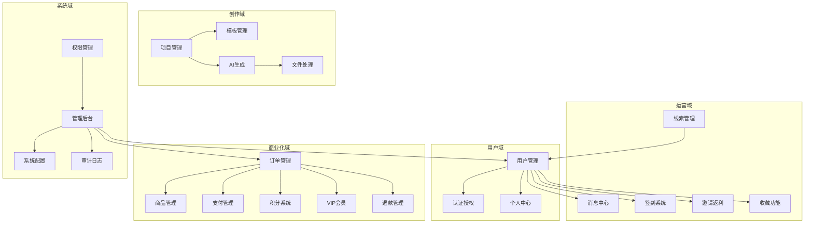
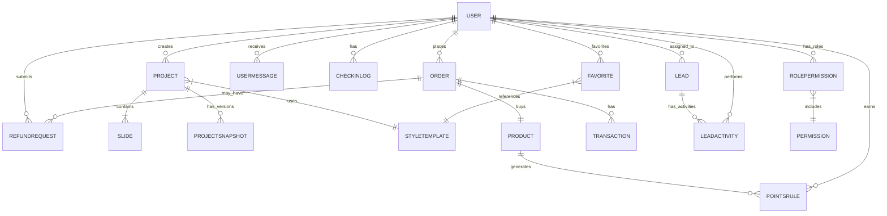
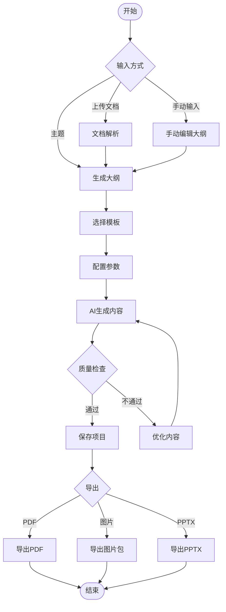
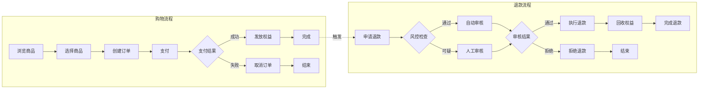
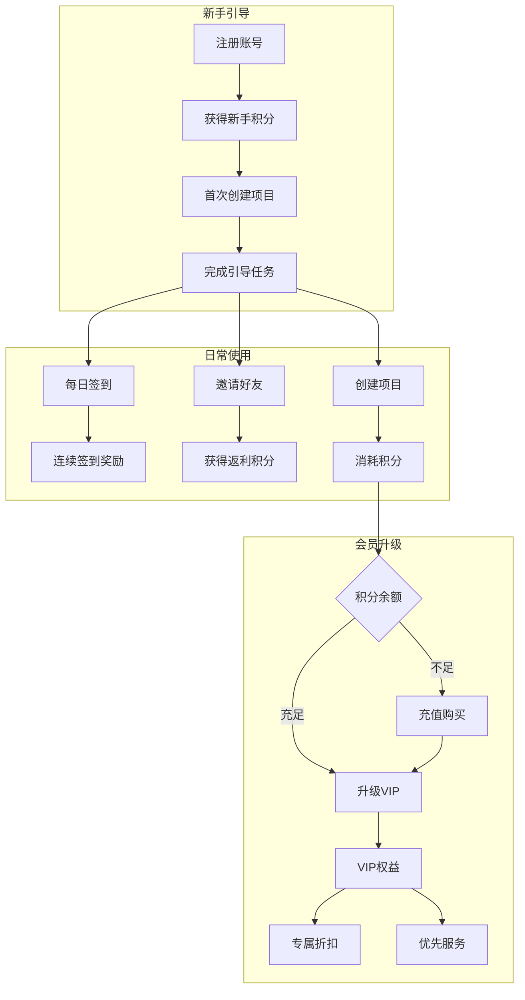
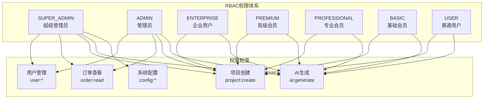
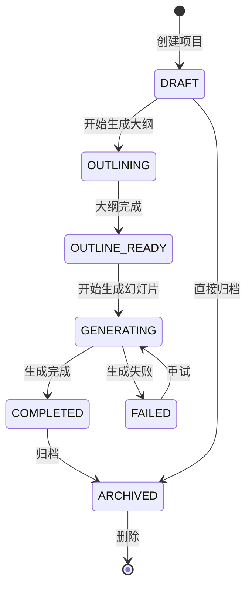
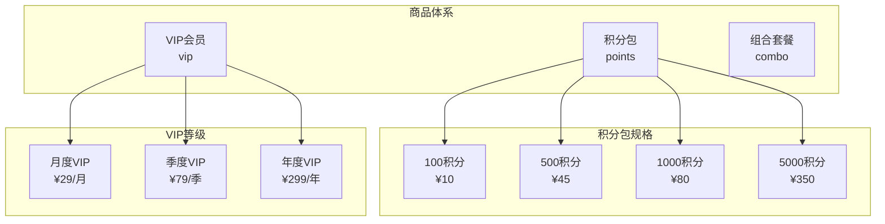

# 📊 YH-AI PPT 业务架构

> **文档状态**: ✅ 已发布  
> **版本**: v2.0 (与PRD v2.0对齐)  
> **最后更新**: 2026-02-16  

本文档描述YH-AI PPT的业务领域划分、模块关系、核心业务流程和业务规则。

---

## 1. 业务领域总览

### 1.1 领域划分

### 1.2 领域统计

| 领域 | 包含模块 | 核心实体 | 业务复杂度 |
|------|---------|---------|-----------|
| **用户域** | 认证、用户管理 | User, SocialAccount | ⭐⭐ |
| **创作域** | 项目、模板、AI生成 | Project, Slide, StyleTemplate | ⭐⭐⭐⭐⭐ |
| **商业化域** | 商品、订单、支付、积分、VIP、退款 | Product, Order, Transaction, PointsRule | ⭐⭐⭐⭐ |
| **运营域** | 线索、消息、签到、邀请、收藏 | Lead, UserMessage, CheckInLog | ⭐⭐⭐ |
| **系统域** | 配置、审计、权限、后台 | GlobalConfig, AuditLog, Permission | ⭐⭐⭐ |

---

## 2. 核心业务实体

### 2.1 实体关系图

### 2.2 关键业务实体定义

| 实体 | 定义 | 核心属性 | 关联实体 |
|------|------|---------|---------|
| **User** | 系统用户 | id, email, role, points, vipLevel | Order, Project, Lead |
| **Project** | PPT项目 | id, title, status, userId | Slide, StyleTemplate |
| **Slide** | 幻灯片 | id, type, content, status, projectId | Project |
| **Order** | 订单 | id, status, amount, userId | Product, Transaction |
| **Product** | 商品 | id, type, price, points | Order |
| **StyleTemplate** | 风格模板 | id, name, styleMap | Project, Favorite |
| **Lead** | 销售线索 | id, status, source, assigneeId | LeadActivity |
| **UserMessage** | 用户消息 | id, type, content, isRead | User |

---

## 3. 核心业务流程

### 3.1 PPT创作流程

**流程说明**:
1. **输入阶段**: 支持主题、文档上传、手动输入三种方式
2. **大纲生成**: AI根据输入生成结构化大纲
3. **风格选择**: 选择或创建视觉模板
4. **批量生成**: AI并行生成各页幻灯片
5. **质量检查**: 自动检查+人工确认
6. **导出交付**: 支持多种格式导出

### 3.2 商业交易流程

**业务规则**:
- 订单创建后30分钟内未支付自动取消
- 支付成功后立即发放积分/VIP权益
- 退款需在订单完成后7天内申请
- 退款金额根据使用情况按比例计算
- 退款成功后自动回收已发放权益

### 3.3 用户成长流程

**成长体系**:
- **积分获取**: 签到、邀请、充值、活动奖励
- **积分消耗**: AI生成、模板下载、增值服务
- **VIP等级**: 基于累计消费自动升级
- **权益差异**: 不同等级享受不同折扣和配额

---

## 4. 模块详细设计

### 4.1 用户域

#### 4.1.1 用户生命周期

| 阶段 | 关键动作 | 系统响应 |
|------|---------|---------|
| **注册** | 填写信息/第三方登录 | 创建用户、发放新手积分、发送欢迎消息 |
| **激活** | 首次创建项目 | 标记为活跃用户、触发新手引导完成 |
| **留存** | 连续登录/使用 | 签到奖励、消息推送、活动通知 |
| **付费** | 首次购买 | 标记为付费用户、发放首购奖励 |
| **推荐** | 邀请好友注册 | 发放邀请奖励、更新邀请统计 |
| **流失预警** | 7天未登录 | 触发召回消息、发放回归奖励 |

#### 4.1.2 权限模型

**角色权限对照**:

| 角色 | 项目配额 | AI生成 | 管理后台 | VIP价格 |
|------|---------|--------|---------|---------|
| SUPER_ADMIN | 无限 | 无限 | ✅全部 | 免费 |
| ADMIN | 无限 | 无限 | ✅部分 | 免费 |
| ENTERPRISE | 1000/月 | 5000/月 | ❌ | 5折 |
| PREMIUM | 500/月 | 2000/月 | ❌ | 7折 |
| PROFESSIONAL | 200/月 | 800/月 | ❌ | 8折 |
| BASIC | 50/月 | 200/月 | ❌ | 9折 |
| USER | 10/月 | 50/月 | ❌ | 原价 |

### 4.2 创作域

#### 4.2.1 项目状态机

**状态说明**:
- **DRAFT**: 草稿状态，仅保存基本信息
- **OUTLINING**: 正在生成大纲，不可编辑
- **OUTLINE_READY**: 大纲已生成，等待确认
- **GENERATING**: 正在生成幻灯片，显示进度
- **COMPLETED**: 生成完成，可导出
- **FAILED**: 生成失败，可查看原因并重试
- **ARCHIVED**: 已归档，可恢复

#### 4.2.2 AI生成策略

| 生成类型 | 适用场景 | 消耗积分 | 平均耗时 |
|---------|---------|---------|---------|
| **大纲生成** | 从主题创建结构 | 5 | 5-10s |
| **单页生成** | 生成单张幻灯片 | 10 | 15-30s |
| **批量生成** | 生成整套PPT | 10×页数 | 2-5min |
| **风格迁移** | 应用新模板 | 5×页数 | 1-2min |
| **内容润色** | 优化已有内容 | 3 | 3-5s |

### 4.3 商业化域

#### 4.3.1 商品类型

#### 4.3.2 价格策略

| 用户等级 | 积分包折扣 | VIP折扣 | 专属商品 |
|---------|-----------|---------|---------|
| USER | 原价 | 原价 | ❌ |
| BASIC | 9折 | 9折 | ❌ |
| PROFESSIONAL | 8折 | 8折 | ✅小额积分包 |
| PREMIUM | 7折 | 7折 | ✅定制模板 |
| ENTERPRISE | 5折 | 5折 | ✅企业套餐 |

### 4.4 运营域

#### 4.4.1 消息触达策略

| 消息类型 | 触发条件 | 渠道 | 优先级 |
|---------|---------|------|--------|
| **系统公告** | 管理员发布 | 站内信+邮件 | 高 |
| **订单通知** | 订单状态变更 | 站内信 | 高 |
| **退款通知** | 退款进度更新 | 站内信+邮件 | 高 |
| **AI完成** | 生成任务完成 | 站内信 | 中 |
| **积分变动** | 积分增减 | 站内信 | 低 |
| **活动营销** | 运营活动 | 站内信 | 低 |
| **安全提醒** | 登录异常 | 邮件 | 高 |

#### 4.4.2 签到奖励规则

| 连续天数 | 基础奖励 | 额外奖励 | 总计 |
|---------|---------|---------|------|
| 第1天 | 5 | 0 | 5 |
| 第2天 | 5 | 0 | 5 |
| 第3天 | 5 | 5 | 10 |
| 第4天 | 5 | 0 | 5 |
| 第5天 | 5 | 0 | 5 |
| 第6天 | 5 | 5 | 10 |
| 第7天 | 5 | 15 | 20 |
| 7天+ | 5 | 5/天 | 10/天 |

**规则说明**:
- 断签后重新从第1天计算
- 每月累计签到7/14/21/28天额外奖励
- VIP用户签到奖励翻倍

---

## 5. 业务规则汇总

### 5.1 数据约束规则

| 实体 | 约束项 | 规则 |
|------|-------|------|
| User | 邮箱唯一性 | 全局唯一，不可重复注册 |
| User | 积分下限 | 最小为0，不允许负积分 |
| Project | 标题长度 | 2-100字符 |
| Project | 幻灯片数量 | 最多50页 |
| Order | 金额精度 | 保留两位小数 |
| Order | 有效期 | 创建后30分钟内有效 |
| Refund | 时间窗口 | 订单完成后7天内可申请 |
| Refund | 金额限制 | 不超过原订单金额 |

### 5.2 业务流程规则

1. **项目创建**: 每个用户同时最多3个进行中的项目
2. **AI生成**: 生成过程中项目锁定，不可编辑
3. **积分消费**: 余额不足时必须先充值
4. **退款审核**: 高风险用户必须人工审核
5. **消息保留**: 系统消息保留90天，自动清理

### 5.3 安全防护规则

1. **登录失败**: 连续5次失败锁定账号30分钟
2. **API限流**: 每IP每分钟最多100次请求
3. **并发限制**: 同一用户同时只能有1个AI生成任务
4. **敏感操作**: 修改密码、退款需二次验证

---

## 6. 与其他文档的关系

- [01_系统架构概述](./01_系统架构概述.md) - 技术实现视角的系统架构
- [02_技术架构](./02_技术架构.md) - 详细技术栈和框架选型
- [04_安全架构](./04_安全架构.md) - 业务安全防护措施
- [../01_Requirements/产品需求规格.md](../01_Requirements/产品需求规格.md) - 需求规格说明
- [../03_Database/01_完整数据字典.md](../03_Database/01_完整数据字典.md) - 数据模型设计

---

**文档版本**: v2.0  
**最后更新**: 2026-02-16  
**维护者**: 产品架构团队
