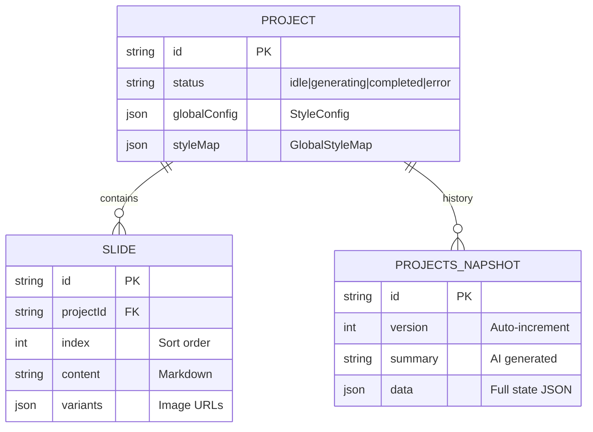

# 🗄️ 数据架构设计书 (Data Architecture Spec)

> **文档版本**: v2.0 (深度重构版)
> **技术栈**: Prisma ORM + SQLite (`dev.db`)
> **核心模式**: 混合持久化与增量快照

---

## 1. 逻辑实体模型 (Entity Models)

系统采用典型的层级化数据结构，通过 Prisma 进行强类型校验。

### 1.1 核心 ER 关系图 (Mermaid)

## 2. 存储策略 (Storage Strategy)

### 2.1 混合持久化
- **SQLite (`dev.db`)**: 存储结构化元数据（项目设置、幻灯片内容大纲、收藏状态）。
- **文件系统 (`/uploads/`)**: 存储非结构化资产（用户的风格参考图、AI 生成的 2K/4K 背景图模板）。
- **JSON Blob**: 为了极致的灵活性，`globalConfig` 和 `styleMap` 字段以 JSON 字符串形式存储，支持前端 `StyleConfig` 接口的动态透传。

### 2.2 级联删除协议 (Cascade Delete)
- **安全保障**: 在 `Slide` 和 `ProjectSnapshot` 模型中显式定义了 `onDelete: Cascade`。
- **行为**: 一旦执行 `prisma.project.delete`，系统会自动清理关联的所有幻灯片片段与历史快照，防止数据库孤儿记录产生。

## 3. 历史管理与版本快照算法

### 3.1 增量快照机制
每次项目保存且发生变更时，系统会触发 `ProjectSnapshot` 的创建：
- **Summary 生成**: 系统将前后的 JSON 状态进行 Diff，调用 AI 自动总结出 20 字以内的变更摘要（如：“更新了封面标题并添加了 2 张内容页”）。
- **状态冻结**: `data` 字段存储整个项目的完整 JSON 状态，支持“时间机器”级的一键回滚。

---
*BananaSlides Gen-AI Data Architecture Spec v2.0*
