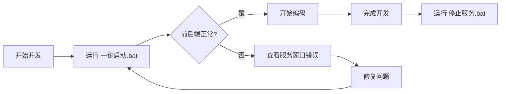

# 🛠️ BananaSlides-GenAI 脚本使用指南

> **最后更新**: 2026-01-26  
> **版本**: v2.0

---

## 📋 脚本清单

### 🚀 核心启动脚本

#### 1. `一键启动.bat` (推荐)

**位置**: 项目根目录  
**功能**: 启动前后端服务的主入口

**执行流程**:
1. 📦 自动备份数据库（保留最近 10 份）
2. 🔧 智能清理端口占用 (1111, 1000)
3. 🗄️ 同步数据库 Schema（无损）
4. 🚀 启动后端服务（Port 1111）
5. ⏳ 等待后端就绪（最长 15 秒）
6. 🎨 启动前端服务（Port 1000）

**使用方法**:
```bash
# 直接双击运行
一键启动.bat
```

**优势**:
- ✅ 自动端口清理，避免 `EADDRINUSE` 错误
- ✅ 后端就绪检测，确保前端启动时后端可用
- ✅ 自动数据库备份，保护数据安全

---

#### 2. `scripts\停止服务.bat`

**功能**: 优雅停止所有运行中的服务

**使用方法**:
```bash
# 双击运行
scripts\停止服务.bat
```

**执行逻辑**:
- 检测 Port 1111 占用 → 终止后端进程
- 检测 Port 1000 占用 → 终止前端进程

---

### 🗄️ 数据库管理脚本

#### 3. `scripts\初始化数据库.bat`

**功能**: 重新同步数据库 Schema（无损操作）

**使用场景**:
- 首次安装项目
- 更新代码后 Schema 有变化
- 数据库结构错误需要修复

**使用方法**:
```bash
scripts\初始化数据库.bat
```

**安全性**: ✅ 不会删除数据，仅更新表结构

---

#### 4. `scripts\备份数据库.bat`

**功能**: 手动创建数据库快照

**备份策略**:
- 备份位置: `server/prisma/dev.db.backup.YYYYMMDD_HHMMSS`
- 自动保留最近 10 份备份
- 超过 10 份自动删除最旧的

**使用方法**:
```bash
# 手动备份
scripts\备份数据库.bat

# 静默备份（无输出）
scripts\备份数据库.bat --silent
```

---

#### 5. `scripts\强制重置数据库(慎用).bat` ⚠️

**功能**: 删除并重建数据库（**会丢失所有数据**）

**安全机制**:
- 二次确认提示
- 自动备份当前数据库
- 完全重置 Schema

**使用场景**:
- 数据库严重损坏
- 需要清空所有测试数据
- 开发环境需要重置

**使用方法**:
```bash
scripts\强制重置数据库(慎用).bat
```

> [!CAUTION]
> **高危操作！务必确认备份！**

---

## 🔧 故障排查

### 问题 1: 启动失败提示端口占用

**现象**:
```
Error: listen EADDRINUSE: address already in use :::1111
```

**解决方案**:
1. 运行 `scripts\停止服务.bat` 清理端口
2. 重新运行 `一键启动.bat`

---

### 问题 2: 前端连接后端失败

**现象**:
```
[vite] http proxy error: /api/projects
Error: connect ECONNREFUSED 127.0.0.1:1111
```

**原因**: 后端服务未启动或启动失败

**解决方案**:
1. 检查后端窗口是否报错
2. 确认后端已完全启动（看到 "API Endpoints" 日志）
3. 如后端启动失败，查看错误信息

---

### 问题 3: 数据丢失

**恢复步骤**:
1. 进入 `server/prisma/` 目录
2. 查看备份文件: `dev.db.backup.*`
3. 停止所有服务
4. 将备份文件重命名为 `dev.db`
5. 重新启动服务

---

## 📝 开发建议

### 推荐工作流



### 数据安全

1. **自动备份**: `一键启动.bat` 每次启动自动备份
2. **手动备份**: 重要操作前运行 `备份数据库.bat`
3. **备份清理**: 自动保留最近 10 份，无需手动清理

---

## 🆕 v2.0 更新日志

### 新增功能

- ✨ 智能端口检测与清理
- ✨ 后端就绪检测（最长等待 15 秒）
- ✨ 新增 `停止服务.bat` 脚本
- ✨ 优化启动流程顺序

### 改进项

- 🎯 精准清理端口占用进程（不再杀死所有 node.exe）
- ⏱️ 后端完全启动后再启动前端（避免连接错误）
- 📊 详细的启动日志输出
- 🎨 美化控制台界面

### 修复问题

- 🐛 修复并发启动导致的连接错误
- 🐛 修复端口占用无法自动清理的问题
- 🐛 修复前端过早启动导致的 502 错误

---

## 💡 高级用法

### 仅启动后端

```bash
cd server
npm run dev
```

### 仅启动前端

```bash
npm run dev
```

### 查看数据库内容

```bash
cd server
npx prisma studio
```

---

## 📞 技术支持

遇到问题？查看以下资源：
- 📖 项目文档: `README.md`
- 🐛 问题报告: GitHub Issues
- 💬 技术讨论: 开发者社区
